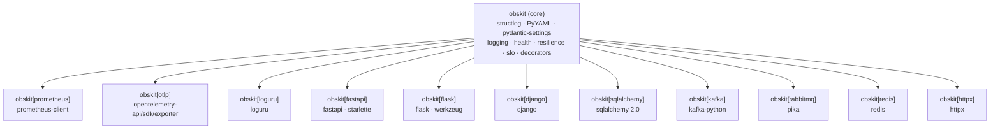
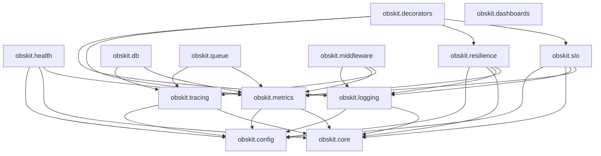
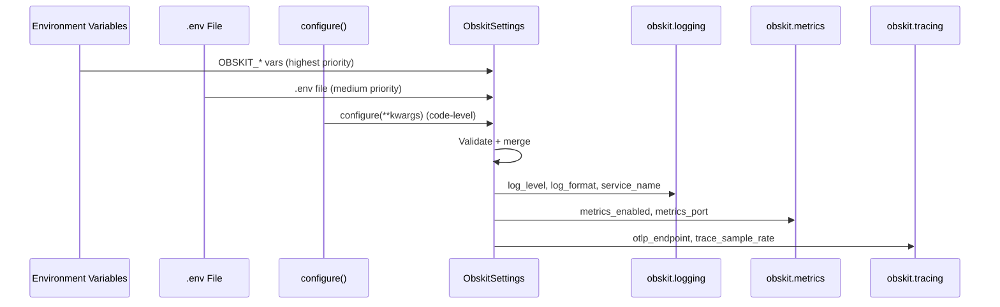
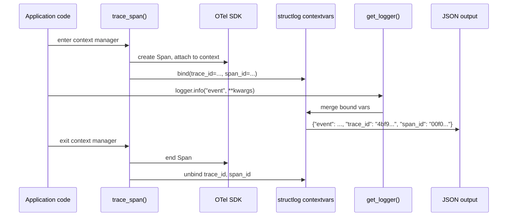
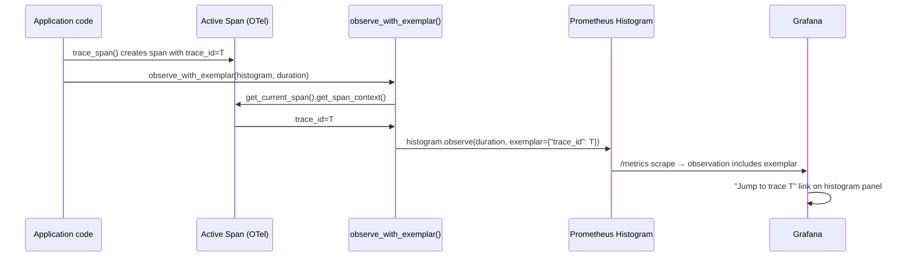
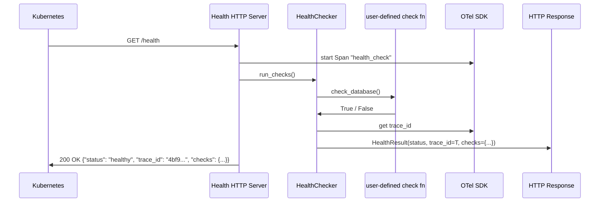

# Architecture Overview

This document describes the internal architecture of obskit v3.0.0 — the
single-package layout, optional extras design, dependency graph, and key data flows.

---

## Package Structure

```
obskit/                          # Git repository root
├── src/
│   └── obskit/                  # Single Python package
│       ├── __init__.py
│       ├── _version.py
│       ├── config.py            # ObskitSettings (pydantic-settings)
│       ├── config_file.py       # YAML config file loader
│       ├── correlation.py       # Correlation/request/session ID management
│       ├── errors/              # Structured exception hierarchy
│       ├── interfaces/          # Abstract base classes (protocols)
│       ├── core/                # Context propagation, diagnose, deprecation
│       ├── logging/             # Structured logging, adapters, OTLP export
│       ├── metrics/             # RED/Golden/USE, exemplars, cardinality guard
│       ├── tracing/             # OpenTelemetry setup, trace_span, auto-instrumentation
│       ├── health/              # Health check framework, HTTP server
│       ├── resilience/          # Circuit breaker, retry, rate limiter
│       ├── slo/                 # SLO/SLA tracking, alerting, error budgets
│       ├── alerts/              # Alert rules and deduplication
│       ├── decorators/          # @with_observability, @trace cross-cutting decorators
│       ├── db/                  # SQLAlchemy instrumentation, query analyzer
│       ├── queue/               # Kafka/RabbitMQ tracing, consumer-lag, DLQ
│       ├── dashboards/          # Grafana dashboard generators
│       ├── middleware/          # Framework middlewares (fastapi, flask, django, grpc)
│       └── testing/             # Test helpers, mocks, ObskitTestCase
├── tests/
│   └── unit/                    # All unit tests (flat structure)
├── benchmarks/                  # pytest-benchmark + macro_runner
├── docs/                        # MkDocs source (this site)
├── mkdocs.yml
└── pyproject.toml               # Package metadata + tool config
```

---

## Optional Extras Design

All functionality is in a single `obskit` package. Heavy optional dependencies are
gated behind **extras** — users only install what they need:



**Key properties:**

- Any combination of extras can be installed independently.
- Optional dependencies that are not installed gracefully no-op (`is_tracing_available()` returns
  `False`) rather than raising `ImportError`.
- All imports (`from obskit.logging import get_logger`) work regardless of which extras are installed.

---

## Module Dependency Graph



**Rules:**
- `obskit.config` and `obskit.core` have no internal obskit dependencies.
- Optional extras (prometheus-client, opentelemetry, etc.) are guarded with runtime availability checks.
- No circular dependencies.

---

## Zero-Overhead Design

All optional integrations are guarded with runtime availability checks.  If an
optional dependency is not installed, the feature degrades gracefully to a no-op.

```python
# Inside obskit/metrics/exemplar.py
def _otel_available() -> bool:
    try:
        from opentelemetry import trace  # noqa: F401
        return True
    except ImportError:
        return False

def observe_with_exemplar(metric, value: float) -> None:
    if not _otel_available():
        metric.observe(value)   # no exemplar — no overhead
        return
    exemplar = get_trace_exemplar()
    metric.observe(value, exemplar=exemplar)
```

This pattern is used throughout:

| Feature | Guard | When not installed |
|---|---|---|
| Trace-log correlation | `is_trace_correlation_available()` | Logs emitted without `trace_id` |
| Exemplars | `is_exemplar_available()` | Observations without exemplar dict |
| OTLP log export | `obskit.logging.otlp` | Logs written to stdout only |
| structlog backend | `OBSKIT_LOGGING_BACKEND=auto` | Falls back to stdlib `logging` |
| Loguru adapter | `is_loguru_available()` | No-op |

---

## Configuration Flow



**Singleton pattern:**
`get_settings()` returns a module-level singleton initialised lazily on first call.
`configure()` sets the singleton from provided kwargs.  Both are thread-safe (guarded
by `threading.Lock`).

---

## Trace-Log Correlation Data Flow



The structlog `contextvars` processor (`merge_contextvars`) picks up the
`trace_id`/`span_id` values that `trace_span()` wrote to the current context.
No manual work is required in application code.

---

## Exemplar Data Flow

Exemplars link a Prometheus histogram observation to a specific OTel trace,
enabling one-click navigation from a metric spike to the corresponding trace.



---

## Health Check with Tracing Data Flow



The `trace_id` in the health response lets you correlate a failed health check
with the OTel trace that captured what the check function actually did.

---

## Plugin / Extension Points

obskit provides several extension points for advanced use cases:

### Custom health checks

```python
from obskit.health import HealthChecker

checker = HealthChecker()

async def check_ml_model() -> bool:
    return await model.ping()

checker.add_check("ml-model", check_ml_model, critical=False)
# critical=False → failure downgrades to DEGRADED, not UNHEALTHY
```

### Custom structlog processors

```python
from obskit.logging.factory import create_logger

def add_datacenter(logger, method, event_dict):
    event_dict["dc"] = "eu-west-1"
    return event_dict

logger = create_logger(__name__, extra_processors=[add_datacenter])
```

### Custom OTel instrumentors

```python
from obskit.tracing import setup_tracing
from opentelemetry.instrumentation.celery import CeleryInstrumentor

setup_tracing(exporter_endpoint="http://tempo:4317", instrument=[])
CeleryInstrumentor().instrument()  # apply manually with custom config
```

### Custom metrics alongside obskit

```python
from prometheus_client import Counter
from obskit.metrics import REDMetrics

# Your custom counter — registered in the same Prometheus registry
CACHE_HITS = Counter("cache_hits_total", "Cache hits", ["cache_name"])

# obskit REDMetrics also in the same registry
red = REDMetrics("api_service")
```

### ObskitSettings subclass

```python
from obskit.config import ObskitSettings

class MyAppSettings(ObskitSettings):
    my_custom_field: str = "default"

settings = MyAppSettings()
```
