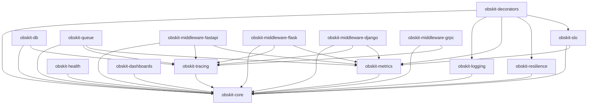
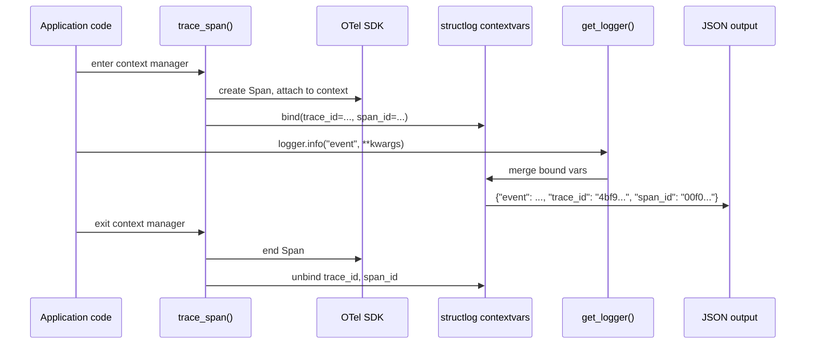
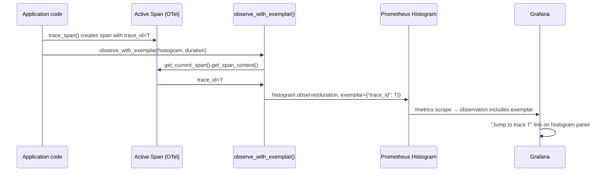
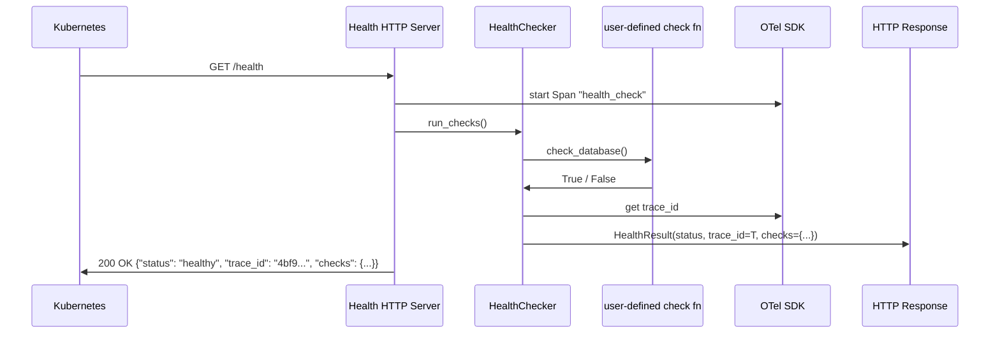

# Architecture Overview

This document describes the internal architecture of obskit v2.0.0 — the monorepo
structure, namespace package design, dependency graph, and key data flows.

---

## Monorepo Structure

```
obskit/                          # Git repository root
├── packages/                    # All installable packages
│   ├── obskit-core/             # Config, errors, interfaces, correlation, test helpers
│   ├── obskit-logging/          # Structured logging, adaptive sampling, OTLP export
│   ├── obskit-metrics/          # RED/Golden/USE, exemplars, cardinality guard
│   ├── obskit-tracing/          # OpenTelemetry setup, trace_span, auto-instrumentation
│   ├── obskit-health/           # Health check framework, HTTP server
│   ├── obskit-resilience/       # Circuit breaker, retry, rate limiter
│   ├── obskit-slo/              # SLO/SLA tracking, alerting, error budgets
│   ├── obskit-decorators/       # @with_observability, @trace cross-cutting decorators
│   ├── obskit-db/               # SQLAlchemy instrumentation, query analyzer
│   ├── obskit-queue/            # Kafka/RabbitMQ tracing, consumer-lag, DLQ
│   ├── obskit-dashboards/       # Grafana dashboard generators
│   ├── obskit-middleware-fastapi/   # FastAPI ASGI middleware
│   ├── obskit-middleware-flask/     # Flask WSGI middleware
│   ├── obskit-middleware-django/    # Django middleware
│   ├── obskit-middleware-grpc/      # gRPC server/client interceptors
│   └── obskit/                  # Meta-package (depends on all above)
├── benchmarks/                  # pytest-benchmark + macro_runner
├── docs/                        # MkDocs source (this site)
├── tests/
│   ├── conftest.py
│   └── integration/             # Cross-package integration tests
├── mkdocs.yml
└── pyproject.toml               # uv workspace root
```

Each package under `packages/` has the same internal layout:

```
packages/obskit-logging/
├── pyproject.toml
├── README.md
├── src/
│   └── obskit/
│       └── logging/             # Python namespace package
│           ├── __init__.py
│           └── ...
└── tests/
    ├── conftest.py
    └── unit/
```

---

## Namespace Package Design

obskit uses Python's [implicit namespace packages](https://peps.python.org/pep-0420/)
(PEP 420 / PEP 402).  All packages share the top-level `obskit` namespace without
any `__init__.py` at the `obskit/` level inside each package's `src/`.

```mermaid
graph TD
    subgraph "Python namespace: obskit"
        A[obskit.config]
        B[obskit.logging]
        C[obskit.metrics]
        D[obskit.tracing]
        E[obskit.health]
        F[obskit.resilience]
        G[obskit.slo]
        H[obskit.decorators]
        I[obskit.db]
        J[obskit.queue]
        K[obskit.core]
        L[obskit.middleware]
        M[obskit.dashboards]
    end

    subgraph "Installed packages"
        P1[obskit-core]
        P2[obskit-logging]
        P3[obskit-metrics]
        P4[obskit-tracing]
        P5[obskit-health]
        P6[obskit-resilience]
        P7[obskit-slo]
        P8[obskit-decorators]
        P9[obskit-db]
        P10[obskit-queue]
        P11[obskit-middleware-fastapi]
        P12[obskit-middleware-flask]
        P13[obskit-middleware-django]
        P14[obskit-middleware-grpc]
        P15[obskit-dashboards]
        P16[obskit meta]
    end

    P1 --> K & A
    P2 --> B
    P3 --> C
    P4 --> D
    P5 --> E
    P6 --> F
    P7 --> G
    P8 --> H
    P9 --> I
    P10 --> J
    P11 & P12 & P13 & P14 --> L
    P15 --> M
    P16 --> P1 & P2 & P3 & P4 & P5 & P6 & P7 & P8 & P9 & P10 & P11 & P12 & P13 & P14 & P15
```



**Key properties:**

- Any single package can be installed independently.
- Packages that are not installed gracefully no-op (`is_tracing_available()` returns
  `False`) rather than raising `ImportError`.
- The meta-package `obskit` (no suffix) re-exports all symbols for backward
  compatibility.

---

## Dependency Graph



**Rules:**
- `obskit-core` has no obskit dependencies.
- No package depends on `obskit-logging` except `obskit-decorators` — logging is
  optional in all other packages.
- No circular dependencies.

---

## Zero-Overhead Design

All optional integrations are guarded with runtime availability checks.  If an
optional dependency is not installed, the feature degrades gracefully to a no-op.

```python
# Inside obskit-metrics (exemplar.py)
def _otel_available() -> bool:
    try:
        from opentelemetry import trace  # noqa: F401
        return True
    except ImportError:
        return False

def observe_with_exemplar(metric, value: float) -> None:
    if not _otel_available():
        metric.observe(value)   # no exemplar — no overhead
        return
    exemplar = get_trace_exemplar()
    metric.observe(value, exemplar=exemplar)
```

This pattern is used throughout:

| Feature | Guard | When not installed |
|---|---|---|
| Trace-log correlation | `is_trace_correlation_available()` | Logs emitted without `trace_id` |
| Exemplars | `is_exemplar_available()` | Observations without exemplar dict |
| OTLP log export | `obskit.logging.otlp` | Logs written to stdout only |
| structlog backend | `OBSKIT_LOGGING_BACKEND=auto` | Falls back to stdlib `logging` |
| Loguru adapter | `is_loguru_available()` | No-op |

---

## Configuration Flow


**Singleton pattern:**
`get_settings()` returns a module-level singleton initialised lazily on first call.
`configure()` sets the singleton from provided kwargs.  Both are thread-safe (guarded
by `threading.Lock`).

---

## Trace-Log Correlation Data Flow



The structlog `contextvars` processor (`merge_contextvars`) picks up the
`trace_id`/`span_id` values that `trace_span()` wrote to the current context.
No manual work is required in application code.

---

## Exemplar Data Flow

Exemplars link a Prometheus histogram observation to a specific OTel trace,
enabling one-click navigation from a metric spike to the corresponding trace.



---

## Health Check with Tracing Data Flow



The `trace_id` in the health response lets you correlate a failed health check
with the OTel trace that captured what the check function actually did.

---

## Plugin / Extension Points

obskit provides several extension points for advanced use cases:

### Custom health checks

```python
from obskit.health import HealthChecker

checker = HealthChecker()

async def check_ml_model() -> bool:
    return await model.ping()

checker.add_check("ml-model", check_ml_model, critical=False)
# critical=False → failure downgrades to DEGRADED, not UNHEALTHY
```

### Custom structlog processors

```python
from obskit.logging.factory import create_logger

def add_datacenter(logger, method, event_dict):
    event_dict["dc"] = "eu-west-1"
    return event_dict

logger = create_logger(__name__, extra_processors=[add_datacenter])
```

### Custom OTel instrumentors

```python
from obskit.tracing import setup_tracing
from opentelemetry.instrumentation.celery import CeleryInstrumentor

setup_tracing(exporter_endpoint="http://tempo:4317", instrument=[])
CeleryInstrumentor().instrument()  # apply manually with custom config
```

### Custom metrics alongside obskit

```python
from prometheus_client import Counter
from obskit.metrics import REDMetrics

# Your custom counter — registered in the same Prometheus registry
CACHE_HITS = Counter("cache_hits_total", "Cache hits", ["cache_name"])

# obskit REDMetrics also in the same registry
red = REDMetrics("api_service")
```

### ObskitSettings subclass

```python
from obskit.config import ObskitSettings

class MyAppSettings(ObskitSettings):
    my_custom_field: str = "default"

settings = MyAppSettings()
```
