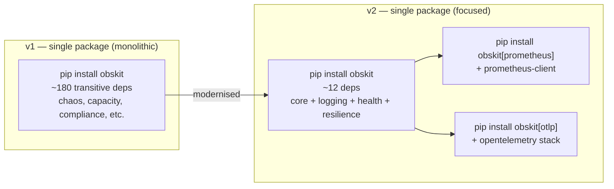
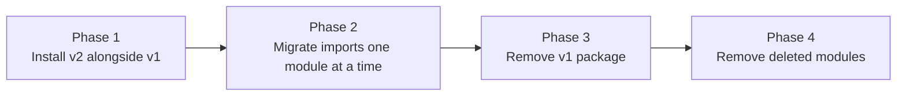

# Migrating from v1 to v2

obskit v2.0.0 modernises the API of the original monolithic package while keeping it as a single install. This guide covers every breaking change and gives you a step-by-step migration path so you can move incrementally without downtime.

---

## Why v2?



| Motivation | Details |
|------------|---------|
| **Smaller installs** | Install only what you use — add `[prometheus]`, `[otlp]`, `[fastapi]` only when needed |
| **Faster Docker builds** | Fewer dependencies = smaller layer cache misses |
| **Better tree-shaking** | Static analysis tools (mypy, pyright) only see the modules you import |
| **`py.typed` markers** | v2 ships `py.typed` for first-class type checking |

---

## Breaking Changes Summary

| Category | v1 behaviour | v2 behaviour | Severity |
|----------|-------------|-------------|----------|
| **Install command** | `pip install obskit` | `pip install "obskit[prometheus,otlp,fastapi]"` | Low — additive change |
| **Logging API** | `configure_logging()` function call | Environment variables + `get_logger()` | **Medium** |
| **Tracing API** | `configure_tracing()` | `setup_tracing()` | **Medium** |
| **Metrics API** | `get_red_metrics()` factory | `REDMetrics(service=…)` constructor | **Medium** |
| **Health API** | `get_health_checker()` factory | `HealthChecker()` constructor | **Medium** |
| **Removed modules** | `obskit.chaos`, `obskit.capacity`, `obskit.compliance_reporter`, `obskit.runbook`, `obskit.secrets_detector`, `obskit.feature_flags`, `obskit.flamegraph` | Not present in v2 | **High if used** |
| **Top-level imports** | `from obskit import configure_logging` | Package-level imports (`from obskit.logging import …`) | **Medium** |
| **Python version** | 3.9+ | **3.11+** | **High if on 3.9/3.10** |

---

## Step-by-Step Migration

### Step 0 — Check Your Python Version

```bash
python --version
# Must be Python 3.11 or later
```

If you are on Python 3.9 or 3.10, upgrade your runtime first. obskit v2 uses `tomllib` (3.11 stdlib), `ExceptionGroup`, and modern `typing` constructs.

### Step 1 — Update requirements.txt

=== "Before (v1)"

    ```text
    obskit[all]==1.5.0
    ```

=== "After (v2) — full install"

    ```text
    # Full equivalent to obskit[all] (includes every extra)
    "obskit[all]==2.2.0"
    ```

=== "After (v2) — focused install (recommended)"

    ```text
    # Focused install — only what you need
    "obskit[prometheus,otlp,fastapi]==2.2.0"
    ```

!!! tip "Discover what you actually use"
    Run this in your project root to find every `obskit` import and know which packages you need:
    ```bash
    grep -r "from obskit" . --include="*.py" | grep -v ".venv" | sort -u
    ```

### Step 2 — Update Imports

Replace all v1 top-level imports with their v2 equivalents using the table below.

#### Import Mapping

| v1 import | v2 import | Package needed |
|-----------|-----------|----------------|
| `from obskit import configure_logging` | `from obskit.logging import get_logger` | `obskit` |
| `from obskit import get_logger` | `from obskit.logging import get_logger` | `obskit` |
| `from obskit import get_red_metrics` | `from obskit.metrics.red import REDMetrics` | `obskit` |
| `from obskit import get_health_checker` | `from obskit.health import HealthChecker` | `obskit` |
| `from obskit import configure_tracing` | `from obskit.tracing import setup_tracing` | `obskit` |
| `from obskit import get_tracer` | `from obskit.tracing import trace_span` | `obskit` |
| `from obskit import start_http_server` | Served via framework route or `prometheus_client.start_http_server` | `obskit` |
| `from obskit.logging import ObsLogger` | `from obskit.logging import get_logger` | `obskit` |
| `from obskit.metrics import REDMetrics` | `from obskit.metrics.red import REDMetrics` | `obskit` |
| `from obskit.tracing import Tracer` | `from obskit.tracing import trace_span, async_trace_span` | `obskit` |
| `from obskit.health import HealthChecker` | `from obskit.health import HealthChecker` | `obskit` (unchanged) |
| `from obskit.resilience import CircuitBreaker` | `from obskit.resilience import CircuitBreaker` | `obskit` (unchanged) |

#### sed One-Liners (macOS / Linux)

```bash
# Logging
sed -i '' 's/from obskit import configure_logging/from obskit.logging import get_logger/g' **/*.py
sed -i '' 's/from obskit import get_logger/from obskit.logging import get_logger/g' **/*.py

# Metrics
sed -i '' 's/from obskit import get_red_metrics/from obskit.metrics.red import REDMetrics/g' **/*.py

# Health
sed -i '' 's/from obskit import get_health_checker/from obskit.health import HealthChecker/g' **/*.py

# Tracing
sed -i '' 's/from obskit import configure_tracing/from obskit.tracing import setup_tracing/g' **/*.py
sed -i '' 's/from obskit import get_tracer/from obskit.tracing import trace_span/g' **/*.py
```

!!! warning "Review all sed replacements manually"
    The one-liners cover the most common patterns. Scan your codebase for any remaining `from obskit import` statements and fix them by hand.

### Step 3 — Replace configure_logging() with Environment Variables

v1 required a `configure_logging()` call at startup. v2 reads configuration from environment variables — no startup call needed.

=== "v1 code"

    ```python
    from obskit import configure_logging

    configure_logging(
        service_name="order-service",
        environment="production",
        log_level="INFO",
        json_output=True,
    )

    from obskit import get_logger
    log = get_logger(__name__)
    ```

=== "v2 code"

    ```python
    # No configure_logging() call needed.
    # Set these environment variables instead:
    #   OBSKIT_SERVICE_NAME=order-service
    #   OBSKIT_ENVIRONMENT=production
    #   OBSKIT_LOG_LEVEL=INFO
    #   OBSKIT_LOG_FORMAT=json

    from obskit.logging import get_logger
    log = get_logger(__name__)

    # service, environment, trace_id are injected automatically from env + OTel context
    log.info("user_logged_in", user_id="u-123")
    ```

=== "Docker / Kubernetes env vars"

    ```yaml
    # kubernetes deployment
    env:
      - name: OBSKIT_SERVICE_NAME
        value: "order-service"
      - name: OBSKIT_ENVIRONMENT
        value: "production"
      - name: OBSKIT_LOG_LEVEL
        value: "INFO"
      - name: OBSKIT_LOG_FORMAT
        value: "json"
    ```

### Step 4 — Replace configure_tracing() with setup_tracing()

=== "v1 code"

    ```python
    from obskit import configure_tracing

    configure_tracing(
        service_name="order-service",
        otlp_endpoint="http://tempo:4317",
        sample_rate=0.1,
    )
    ```

=== "v2 code"

    ```python
    from obskit.tracing import setup_tracing

    setup_tracing(
        exporter_endpoint="http://tempo:4317",  # renamed parameter
        sample_rate=0.1,
        # service_name is read from OBSKIT_SERVICE_NAME env var
        debug=False,
    )
    ```

!!! warning "Parameter rename: `otlp_endpoint` → `exporter_endpoint`"
    The `otlp_endpoint` keyword argument was renamed to `exporter_endpoint` in v2 to support non-OTLP exporters in the future. Update all call sites.

### Step 5 — Replace get_red_metrics() with REDMetrics()

=== "v1 code"

    ```python
    from obskit import get_red_metrics

    red = get_red_metrics("order-service")
    red.observe(endpoint="/orders", method="POST", status=200, duration=0.12)
    ```

=== "v2 code"

    ```python
    from obskit.metrics.red import REDMetrics

    red = REDMetrics(service="order-service")
    red.record_request(
        endpoint="/orders",
        method="POST",
        status=200,
        duration=0.12,     # seconds
    )
    ```

!!! note "Method rename: `observe()` → `record_request()`"
    The `observe()` method was renamed to `record_request()` to better communicate its intent. The parameter signature is otherwise identical.

### Step 6 — Replace get_health_checker() with HealthChecker()

=== "v1 code"

    ```python
    from obskit import get_health_checker, start_http_server

    checker = get_health_checker(service="order-service", version="1.5.0")
    checker.register("database", lambda: db.ping())
    start_http_server(port=9090)

    result = checker.check()
    ```

=== "v2 code"

    ```python
    from obskit.health import HealthChecker, create_http_check

    # service and version read from OBSKIT_SERVICE_NAME / OBSKIT_VERSION env vars
    checker = HealthChecker()
    checker.add_check("database", create_http_check("http://postgres:5432/ping"))

    # Expose /health via your framework instead of start_http_server()
    # (see the FastAPI example in first-app.md)

    result = await checker.check_health()   # now async
    print(result.to_dict())
    ```

!!! warning "check() is now async"
    `checker.check()` has been replaced by `await checker.check_health()`. If you are calling it from synchronous code, use `asyncio.run(checker.check_health())`.

### Step 7 — Remove Deleted Modules

The following modules were removed from the v2 monorepo because they are out-of-scope for an observability toolkit. If your code imports them, you must replace them with the suggested alternatives.

| Removed module | Why removed | Replacement |
|----------------|-------------|-------------|
| `obskit.chaos` | Chaos engineering belongs in a dedicated tool | `chaos-toolkit`, `chaostoolkit-kubernetes` |
| `obskit.capacity` | Capacity planning is ops/FinOps tooling | Grafana dashboards + AlertManager |
| `obskit.compliance_reporter` | GRC governance requires a dedicated platform | OPA, Styra |
| `obskit.runbook` | Incident runbooks are managed externally | PagerDuty, Opsgenie, Confluence |
| `obskit.secrets_detector` | Security scanning belongs in CI, not the app | `detect-secrets`, `trufflehog` |
| `obskit.feature_flags` | Platform engineering concern | `flagsmith`, `unleash`, `LaunchDarkly` |
| `obskit.flamegraph` | Performance profiling belongs in a profiler | `py-spy`, `Austin`, `Scalene` |
| `obskit.deployment` | Deployment tooling | `argocd`, `flux`, Helm |
| `obskit.resource_predictor` | ML ops / FinOps tooling | Kubernetes VPA, KEDA |
| `obskit.root_cause` | AIOps / ML tooling | Grafana Incident, PagerDuty AIOps |
| `obskit.self_healing` | Kubernetes-native concern | Kubernetes probes + operators |
| `obskit.incident_timeline` | Incident management platform concern | PagerDuty, Opsgenie |

### Step 8 — Update Tests

=== "v1 test"

    ```python
    import pytest
    from obskit import configure_logging, get_logger

    def test_order_creation():
        configure_logging(service_name="test", log_level="DEBUG")
        log = get_logger("test")
        # ...
    ```

=== "v2 test"

    ```python
    import os
    import pytest
    from obskit.logging import get_logger

    @pytest.fixture(autouse=True)
    def obskit_env(monkeypatch):
        monkeypatch.setenv("OBSKIT_SERVICE_NAME", "test")
        monkeypatch.setenv("OBSKIT_LOG_FORMAT", "json")
        monkeypatch.setenv("OBSKIT_LOG_LEVEL", "DEBUG")

    def test_order_creation():
        log = get_logger("test")
        # ...
    ```

=== "Using obskit testing helpers"

    obskit ships a `testing` module with helpers for unit tests:

    ```python
    from obskit.testing import ObskitTestCase, mock_logger, mock_tracer

    class TestOrderService(ObskitTestCase):
        def test_creates_order(self):
            with mock_logger() as captured_logs:
                create_order(order_id="ord-1")
            self.assertLogEvent(captured_logs, "order_created", order_id="ord-1")
    ```

---

## Configuration Mapping

| v1 configure_logging() kwarg | v2 environment variable | Notes |
|-------------------------------|------------------------|-------|
| `service_name="order-service"` | `OBSKIT_SERVICE_NAME=order-service` | |
| `environment="production"` | `OBSKIT_ENVIRONMENT=production` | |
| `log_level="INFO"` | `OBSKIT_LOG_LEVEL=INFO` | |
| `json_output=True` | `OBSKIT_LOG_FORMAT=json` | `False` → `console` |
| `include_timestamp=True` | `OBSKIT_LOG_INCLUDE_TIMESTAMP=true` | |

| v1 configure_tracing() kwarg | v2 setup_tracing() kwarg / env var | Notes |
|-------------------------------|-------------------------------------|-------|
| `service_name="order-service"` | `OBSKIT_SERVICE_NAME=order-service` (env) | Read from env, not kwarg |
| `otlp_endpoint="http://…"` | `exporter_endpoint="http://…"` | Parameter renamed |
| `sample_rate=0.1` | `sample_rate=0.1` | Unchanged |
| _(not available)_ | `debug=True` | New: prints spans to stdout |
| _(not available)_ | `instrument=["fastapi", …]` | New: explicit instrumentor list |

---

## Incremental Migration Strategy

You do not need to migrate everything at once. Here is a low-risk phased approach.



### Phase 1 — Dual Install (1-2 days)

Add the new packages to `requirements.txt` without removing `obskit`:

```text
# OLD (keep temporarily)
obskit==1.5.0

# NEW (add)
"obskit[prometheus,otlp,fastapi]==2.2.0"
```

!!! warning "v1 and v2 packages coexist but share the obskit.* namespace"
    During the dual-install phase, v1 and v2 populate the same Python namespace. The last installed package wins for overlapping paths. Migrate fully before removing `obskit==1.x` to avoid import resolution surprises.

### Phase 2 — Migrate Module by Module

Work through your codebase file by file, converting imports from v1 to v2. The import mapping table above covers every case. Commit each module separately so rollback is easy.

### Phase 3 — Remove v1

Once all imports are converted, remove `obskit==1.5.0` from `requirements.txt` and confirm your tests pass.

```bash
pip uninstall obskit
pytest -x --tb=short
```

### Phase 4 — Remove Deleted Modules

Replace any usage of the removed modules (chaos, capacity, etc.) with the suggested alternatives.

---

## Rollback Strategy

If migration causes issues in production, roll back by pinning to `obskit==1.5.0` and reverting `requirements.txt`. The v1 and v2 packages do not conflict at install time, so you can safely switch back without database migrations or config changes.

```bash
pip install "obskit==1.5.0"
# revert requirements.txt in git
git revert HEAD~1
```

---

## FAQ

**Will my old code break immediately after upgrading?**

: Not immediately if you install the `obskit` meta-package (`pip install obskit==2.0.0`) — it includes all v2 sub-packages. However, v1 top-level imports like `from obskit import configure_logging` will raise `ImportError` because those functions no longer exist at the top-level namespace. You must update the import paths.

**Can I migrate incrementally, one service at a time?**

: Yes. Each service is an independent Python process. You can migrate `order-service` to v2 while `user-service` stays on v1. The two services communicate over HTTP/gRPC; their internal package choices do not affect each other.

**Do I need to change my Kubernetes manifests?**

: Only to add environment variables (`OBSKIT_SERVICE_NAME`, `OBSKIT_OTLP_ENDPOINT`, etc.) if they are not already present. The HTTP ports, health check URLs, and Prometheus scrape paths are unchanged.

**My tests import from `obskit` directly. Do they break?**

: Yes — any `from obskit import configure_logging` style import will break. Follow Step 8 above to update test fixtures. The obskit `testing` module provides mock helpers to make test setup simpler.

**What happened to `obskit.decorators.context_managers`?**

: It is at `obskit.decorators` — included in the base `obskit` package. Update the import path: `from obskit.decorators import context_managers`.

**Is the `/metrics` endpoint path still `/metrics`?**

: Yes. The `OBSKIT_METRICS_PATH` default is `/metrics`. If you had `start_http_server()` in v1, replace it with a framework route (see the FastAPI example in [first-app.md](first-app.md)).

**Do trace IDs in logs look different in v2?**

: No. The format is the same W3C TraceContext 32-character hex string. Existing log parsing rules and Grafana log correlations continue to work.

**Does v2 support the same auto-instrumentors as v1?**

: Yes, and more. v2 `setup_tracing(instrument=["fastapi", "sqlalchemy", "redis", "httpx", "celery"])` covers all v1 auto-instruments plus new ones. The `[auto]` extra installs all available instrumentors.

---

## Getting Help

- Open an issue: [github.com/talaatmagdyx/obskit/issues](https://github.com/talaatmagdyx/obskit/issues)
- Migration discussion: [github.com/talaatmagdyx/obskit/discussions](https://github.com/talaatmagdyx/obskit/discussions)
- Full v1 → v2 ADR: [decisions/adr-001-namespace-packages.md](../decisions/adr-001-namespace-packages.md)

---

## See Also

- [Installation](installation.md) — fresh install options and Docker snippets
- [Quick Start](quickstart.md) — v2 API in five minutes
- [Your First App](first-app.md) — complete FastAPI Order Service tutorial
- [Configuration Reference](../reference/configuration.md) — every `OBSKIT_*` variable
