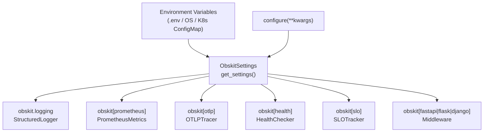

# Configuration Reference

obskit v2.0.0 uses **Pydantic Settings** (`pydantic-settings`) for all configuration. Every setting can be supplied via environment variables, a `.env` file, or programmatic Python calls. Configuration is centralised in `ObskitSettings` and propagated automatically to every package — you configure once, and logging, metrics, tracing, and health checks all pick it up.

---

## Configuration Priority

Settings are resolved in descending priority:

```
1. Programmatic kwargs passed to configure()   ← highest
2. Environment variables (OBSKIT_* prefix)
3. .env file values
4. Field default values                        ← lowest
```

---

## ObskitSettings Class

```python
from obskit.config import ObskitSettings, configure, get_settings, reset_settings
```

### Service Identification

| Field | Type | Default | Env Var | Description |
|---|---|---|---|---|
| `service_name` | `str` | `"unknown"` | `OBSKIT_SERVICE_NAME` | Appears in every log line, metric label, and trace attribute |
| `environment` | `str` | `"development"` | `OBSKIT_ENVIRONMENT` | Deployment tier — filters alerts and dashboards |
| `version` | `str` | `"0.0.0"` | `OBSKIT_VERSION` | Injected from CI/CD; appears in traces and dashboards |

!!! warning "Always set `service_name`"
    Leaving `service_name` as `"unknown"` will cause all your telemetry to be attributed to the same opaque bucket in Grafana. Set it in every deployment.

---

### Tracing (OpenTelemetry)

| Field | Type | Default | Env Var | Description |
|---|---|---|---|---|
| `tracing_enabled` | `bool` | `True` | `OBSKIT_TRACING_ENABLED` | Master switch for distributed tracing |
| `otlp_endpoint` | `str` | `"http://localhost:4317"` | `OBSKIT_OTLP_ENDPOINT` | OTLP gRPC endpoint (Tempo, Jaeger, Collector) |
| `otlp_insecure` | `bool` | `True` | `OBSKIT_OTLP_INSECURE` | Set `False` in production to require TLS |
| `trace_sample_rate` | `float` | `1.0` | `OBSKIT_TRACE_SAMPLE_RATE` | `0.0`–`1.0`; lower in high-traffic production |
| `trace_export_queue_size` | `int` | `2048` | `OBSKIT_TRACE_EXPORT_QUEUE_SIZE` | In-memory buffer size; excess spans are dropped |
| `trace_export_batch_size` | `int` | `512` | `OBSKIT_TRACE_EXPORT_BATCH_SIZE` | Max spans per OTLP export batch |
| `trace_export_timeout` | `float` | `30.0` | `OBSKIT_TRACE_EXPORT_TIMEOUT` | Seconds before export attempt is abandoned |

!!! tip "Sampling Strategy"
    Use `1.0` (100 %) in development and staging. Use `0.1`–`0.01` in production for high-throughput services. See the [Production Checklist](production.md) for guidance.

---

### Metrics (Prometheus)

| Field | Type | Default | Env Var | Description |
|---|---|---|---|---|
| `metrics_enabled` | `bool` | `True` | `OBSKIT_METRICS_ENABLED` | Master switch for Prometheus metrics |
| `metrics_port` | `int` | `9090` | `OBSKIT_METRICS_PORT` | Port for the `/metrics` HTTP server |
| `metrics_path` | `str` | `"/metrics"` | `OBSKIT_METRICS_PATH` | URL path for the metrics endpoint |
| `metrics_method` | `str` | `"red"` | `OBSKIT_METRICS_METHOD` | `red` / `golden` / `use` / `all` |
| `use_histogram` | `bool` | `True` | `OBSKIT_USE_HISTOGRAM` | Prometheus histograms for latency (recommended) |
| `use_summary` | `bool` | `False` | `OBSKIT_USE_SUMMARY` | Prometheus summaries — not aggregatable across replicas |
| `metrics_sample_rate` | `float` | `1.0` | `OBSKIT_METRICS_SAMPLE_RATE` | Record only this fraction of metric observations |
| `metrics_auth_enabled` | `bool` | `False` | `OBSKIT_METRICS_AUTH_ENABLED` | Require bearer token to scrape `/metrics` |
| `metrics_auth_token` | `str` | `""` | `OBSKIT_METRICS_AUTH_TOKEN` | Token value — set only via env/secret, never hardcode |
| `metrics_rate_limit_enabled` | `bool` | `False` | `OBSKIT_METRICS_RATE_LIMIT_ENABLED` | Rate-limit scrape requests |
| `metrics_rate_limit_requests` | `int` | `60` | `OBSKIT_METRICS_RATE_LIMIT_REQUESTS` | Max scrape requests per minute |

---

### Logging

| Field | Type | Default | Env Var | Description |
|---|---|---|---|---|
| `log_level` | `str` | `"INFO"` | `OBSKIT_LOG_LEVEL` | `DEBUG` / `INFO` / `WARNING` / `ERROR` / `CRITICAL` |
| `log_format` | `str` | `"json"` | `OBSKIT_LOG_FORMAT` | `json` for production, `console` for development |
| `log_include_timestamp` | `bool` | `True` | `OBSKIT_LOG_INCLUDE_TIMESTAMP` | Disable if your log aggregator stamps entries |
| `log_sample_rate` | `float` | `1.0` | `OBSKIT_LOG_SAMPLE_RATE` | Fraction of log events to emit |
| `logging_backend` | `str` | `"structlog"` | `OBSKIT_LOGGING_BACKEND` | `structlog` / `auto` |

---

### Health Checks

| Field | Type | Default | Env Var | Description |
|---|---|---|---|---|
| `health_check_timeout` | `float` | `5.0` | `OBSKIT_HEALTH_CHECK_TIMEOUT` | Per-check timeout in seconds |

---

### Async Queue & Self-Metrics

| Field | Type | Default | Env Var | Description |
|---|---|---|---|---|
| `async_metric_queue_size` | `int` | `10000` | `OBSKIT_ASYNC_METRIC_QUEUE_SIZE` | Max buffered metric events before drop |
| `enable_self_metrics` | `bool` | `True` | `OBSKIT_ENABLE_SELF_METRICS` | Expose obskit's own internal metrics |

---

## Environment Variable Quick Reference

```bash
# ── Service Identity ──────────────────────────────────────────────────────────
OBSKIT_SERVICE_NAME=order-service
OBSKIT_SERVICE_VERSION=2.1.0          # alias; maps to `version`
OBSKIT_ENVIRONMENT=production

# ── Tracing ───────────────────────────────────────────────────────────────────
OBSKIT_TRACING_ENABLED=true
OBSKIT_OTLP_ENDPOINT=http://tempo:4317
OBSKIT_OTLP_INSECURE=false            # use TLS in production
OBSKIT_TRACE_SAMPLE_RATE=0.1          # 10 % sampling

# ── Metrics ───────────────────────────────────────────────────────────────────
OBSKIT_METRICS_ENABLED=true
OBSKIT_METRICS_PORT=9090
OBSKIT_METRICS_PATH=/metrics
OBSKIT_METRICS_METHOD=red

# ── Logging ───────────────────────────────────────────────────────────────────
OBSKIT_LOG_LEVEL=INFO
OBSKIT_LOG_FORMAT=json

# ── Health ────────────────────────────────────────────────────────────────────
OBSKIT_HEALTH_CHECK_TIMEOUT=5.0

# ── Resilience ────────────────────────────────────────────────────────────────
OBSKIT_CIRCUIT_BREAKER_FAILURE_THRESHOLD=5
OBSKIT_CIRCUIT_BREAKER_RECOVERY_TIMEOUT=30.0
OBSKIT_RETRY_MAX_ATTEMPTS=3
OBSKIT_RETRY_BASE_DELAY=1.0
```

---

## `.env` File Example

Place this file in your project root for local development. It is **never** committed to version control (add it to `.gitignore`).

```ini
# .env — local development only
# ------------------------------------------------------------
OBSKIT_SERVICE_NAME=order-service
OBSKIT_ENVIRONMENT=development
OBSKIT_VERSION=dev-local

# Tracing — local Tempo via docker-compose
OBSKIT_TRACING_ENABLED=true
OBSKIT_OTLP_ENDPOINT=http://localhost:4317
OBSKIT_OTLP_INSECURE=true
OBSKIT_TRACE_SAMPLE_RATE=1.0

# Metrics
OBSKIT_METRICS_ENABLED=true
OBSKIT_METRICS_PORT=9090

# Logging — human-readable in development
OBSKIT_LOG_LEVEL=DEBUG
OBSKIT_LOG_FORMAT=console

# Health
OBSKIT_HEALTH_CHECK_TIMEOUT=5.0

# Resilience — faster feedback in dev
OBSKIT_CIRCUIT_BREAKER_FAILURE_THRESHOLD=3
OBSKIT_CIRCUIT_BREAKER_RECOVERY_TIMEOUT=10.0
OBSKIT_RETRY_MAX_ATTEMPTS=2
```

---

## Docker Compose Environment Section

```yaml
# docker-compose.yml
version: "3.9"

services:
  order-service:
    build: .
    ports:
      - "8000:8000"   # API
      - "9090:9090"   # Prometheus metrics
    environment:
      # Service identity
      OBSKIT_SERVICE_NAME: order-service
      OBSKIT_ENVIRONMENT: development
      OBSKIT_VERSION: "2.1.0"

      # Tracing → local Tempo
      OBSKIT_TRACING_ENABLED: "true"
      OBSKIT_OTLP_ENDPOINT: http://tempo:4317
      OBSKIT_OTLP_INSECURE: "true"
      OBSKIT_TRACE_SAMPLE_RATE: "1.0"

      # Metrics
      OBSKIT_METRICS_ENABLED: "true"
      OBSKIT_METRICS_PORT: "9090"

      # Logging
      OBSKIT_LOG_LEVEL: INFO
      OBSKIT_LOG_FORMAT: json

      # Health
      OBSKIT_HEALTH_CHECK_TIMEOUT: "5.0"
    depends_on:
      - postgres
      - redis
      - tempo

  prometheus:
    image: prom/prometheus:latest
    volumes:
      - ./prometheus.yml:/etc/prometheus/prometheus.yml
    ports:
      - "9091:9090"

  grafana:
    image: grafana/grafana:latest
    ports:
      - "3000:3000"
    environment:
      GF_SECURITY_ADMIN_PASSWORD: admin

  tempo:
    image: grafana/tempo:latest
    command: ["-config.file=/etc/tempo.yaml"]
    volumes:
      - ./tempo.yaml:/etc/tempo.yaml
    ports:
      - "4317:4317"   # OTLP gRPC
      - "3200:3200"   # Tempo HTTP API
```

---

## Kubernetes ConfigMap + Secret

Split configuration into a **ConfigMap** (non-sensitive) and a **Secret** (sensitive credentials):

=== "ConfigMap (non-sensitive)"

    ```yaml
    # k8s/configmap.yaml
    apiVersion: v1
    kind: ConfigMap
    metadata:
      name: order-service-obskit
      namespace: production
      labels:
        app: order-service
        version: "2.1.0"
    data:
      OBSKIT_SERVICE_NAME: "order-service"
      OBSKIT_ENVIRONMENT: "production"
      OBSKIT_VERSION: "2.1.0"

      # Tracing
      OBSKIT_TRACING_ENABLED: "true"
      OBSKIT_OTLP_ENDPOINT: "http://tempo-distributor.monitoring:4317"
      OBSKIT_OTLP_INSECURE: "false"
      OBSKIT_TRACE_SAMPLE_RATE: "0.1"

      # Metrics
      OBSKIT_METRICS_ENABLED: "true"
      OBSKIT_METRICS_PORT: "9090"
      OBSKIT_METRICS_METHOD: "red"

      # Logging
      OBSKIT_LOG_LEVEL: "INFO"
      OBSKIT_LOG_FORMAT: "json"

      # Health
      OBSKIT_HEALTH_CHECK_TIMEOUT: "5.0"

      # Resilience
      OBSKIT_CIRCUIT_BREAKER_FAILURE_THRESHOLD: "5"
      OBSKIT_CIRCUIT_BREAKER_RECOVERY_TIMEOUT: "30.0"
      OBSKIT_RETRY_MAX_ATTEMPTS: "3"
    ```

=== "Secret (sensitive)"

    ```yaml
    # k8s/secret.yaml
    apiVersion: v1
    kind: Secret
    metadata:
      name: order-service-obskit-secrets
      namespace: production
    type: Opaque
    # Values must be base64-encoded: echo -n 'value' | base64
    data:
      OBSKIT_METRICS_AUTH_TOKEN: "c3VwZXItc2VjcmV0LXRva2Vu"
    ```

=== "Deployment reference"

    ```yaml
    # k8s/deployment.yaml (env section)
    spec:
      containers:
        - name: order-service
          image: ghcr.io/acme/order-service:2.1.0
          envFrom:
            - configMapRef:
                name: order-service-obskit
            - secretRef:
                name: order-service-obskit-secrets
    ```

---

## Pydantic Validation Details

`ObskitSettings` uses Pydantic v2 with `pydantic-settings`. Key validation rules:

```python
# Range constraints enforced at parse time
trace_sample_rate: float = Field(default=1.0, ge=0.0, le=1.0)
metrics_port: int = Field(default=9090, ge=1, le=65535)
health_check_timeout: float = Field(default=5.0, ge=0.1)
async_metric_queue_size: int = Field(default=10000, ge=100, le=1_000_000)

# Enum validation
log_level: Literal["DEBUG", "INFO", "WARNING", "ERROR", "CRITICAL"]
log_format: Literal["json", "console"]
logging_backend: Literal["structlog", "auto"]
metrics_method: MetricsMethod  # Enum: red
```

Pydantic raises `ValidationError` at startup if any value is out of range:

```python
import os
os.environ["OBSKIT_TRACE_SAMPLE_RATE"] = "1.5"  # invalid

from obskit.config import ObskitSettings
settings = ObskitSettings()
# pydantic_core.ValidationError:
#   trace_sample_rate: Input should be less than or equal to 1
```

---

## Programmatic Configuration

Call `configure()` **once** at application startup, before any obskit import that triggers lazy initialisation:

```python
from obskit import configure

configure(
    service_name="order-service",
    environment="production",
    version="2.1.0",

    # Tracing
    tracing_enabled=True,
    otlp_endpoint="http://tempo:4317",
    otlp_insecure=False,
    trace_sample_rate=0.1,

    # Metrics
    metrics_enabled=True,
    metrics_port=9090,
    metrics_method="red",

    # Logging
    log_level="INFO",
    log_format="json",

    # Health
    health_check_timeout=5.0,
)
```

Programmatic kwargs **override** environment variables. This allows you to compute values at runtime:

```python
import os
from obskit import configure

# Read version from container label baked in at build time
configure(
    service_name=os.getenv("APP_NAME", "order-service"),
    version=os.getenv("APP_VERSION", "dev"),
    environment=os.getenv("DEPLOY_ENV", "development"),
)
```

---

## How Settings Propagate to All Packages

Every obskit package calls `get_settings()` internally — you do not need to pass settings between packages.



### Example: settings consumed by logging

```python
# obskit.logging reads settings automatically
from obskit.logging import get_logger

logger = get_logger(__name__)
# Internally calls get_settings() to read:
#   log_level, log_format, log_include_timestamp,
#   log_sample_rate, logging_backend, service_name, version, environment
```

---

## Accessing Settings at Runtime

```python
from obskit.config import get_settings, validate_config

settings = get_settings()
print(f"Service : {settings.service_name}")
print(f"Env     : {settings.environment}")
print(f"OTLP    : {settings.otlp_endpoint}")
print(f"Sampling: {settings.trace_sample_rate}")

# Validate configuration — returns (bool, list[str])
is_valid, errors = validate_config()
if not is_valid:
    for err in errors:
        print(f"[CONFIG ERROR] {err}")
```

`validate_config()` checks:

- `service_name` is not the default `"unknown"`
- `otlp_endpoint` starts with `http://` or `https://` when tracing is enabled
- `otlp_insecure=True` in a `production` environment triggers an error
- `metrics_port` is a valid TCP port
- `log_level` is one of the five accepted literals
- `trace_sample_rate` is within `[0.0, 1.0]`

---

## Overriding Settings in Tests

Use `reset_settings()` in `conftest.py` to guarantee a clean slate between test runs:

```python
# conftest.py
import pytest
from obskit.config import configure, reset_settings

@pytest.fixture(autouse=True)
def obskit_test_settings():
    """Apply deterministic settings for every test."""
    configure(
        service_name="test-service",
        environment="test",
        version="0.0.0-test",
        # Disable network I/O in tests
        tracing_enabled=False,
        metrics_enabled=False,
        log_level="WARNING",
        log_format="console",
    )
    yield
    reset_settings()
```

Individual tests can override specific fields:

```python
def test_high_sampling():
    from obskit.config import configure, get_settings
    configure(trace_sample_rate=0.5)
    settings = get_settings()
    assert settings.trace_sample_rate == 0.5
```

!!! warning "Never call `reset_settings()` in production code"
    It is designed exclusively for test isolation. Calling it in production will cause all packages to re-initialise on the next `get_settings()` call.

---

## Configuration via CI/CD

Pass settings as pipeline environment variables so no secrets live in source code:

=== "GitHub Actions"

    ```yaml
    # .github/workflows/deploy.yml
    - name: Deploy to production
      env:
        OBSKIT_SERVICE_NAME: order-service
        OBSKIT_ENVIRONMENT: production
        OBSKIT_VERSION: ${{ github.sha }}
        OBSKIT_OTLP_ENDPOINT: ${{ secrets.OTLP_ENDPOINT }}
        OBSKIT_METRICS_AUTH_TOKEN: ${{ secrets.METRICS_TOKEN }}
      run: kubectl apply -f k8s/
    ```

=== "GitLab CI"

    ```yaml
    deploy:
      stage: deploy
      variables:
        OBSKIT_SERVICE_NAME: "order-service"
        OBSKIT_ENVIRONMENT: "production"
        OBSKIT_VERSION: "$CI_COMMIT_SHA"
        OBSKIT_OTLP_ENDPOINT: "$OTLP_ENDPOINT"    # from GitLab secret
      script:
        - kubectl apply -f k8s/
    ```

---

## Diagnosing Configuration Problems

Run the built-in diagnose tool to see the effective configuration:

```bash
python -m obskit.core.diagnose
```

Sample output:

```
obskit v2.0.0 — Diagnostic Report
====================================
Service        : order-service
Environment    : production
Version        : 2.1.0

Tracing
  enabled      : True
  otlp_endpoint: http://tempo:4317
  sample_rate  : 0.1
  insecure     : False    ✓

Metrics
  enabled      : True
  port         : 9090
  path         : /metrics
  method       : red

Logging
  level        : INFO
  format       : json
  backend      : structlog

Health
  timeout      : 5.0 s

Validation     : PASS
```

See [Diagnose CLI](../guides/diagnose.md) for full documentation.
