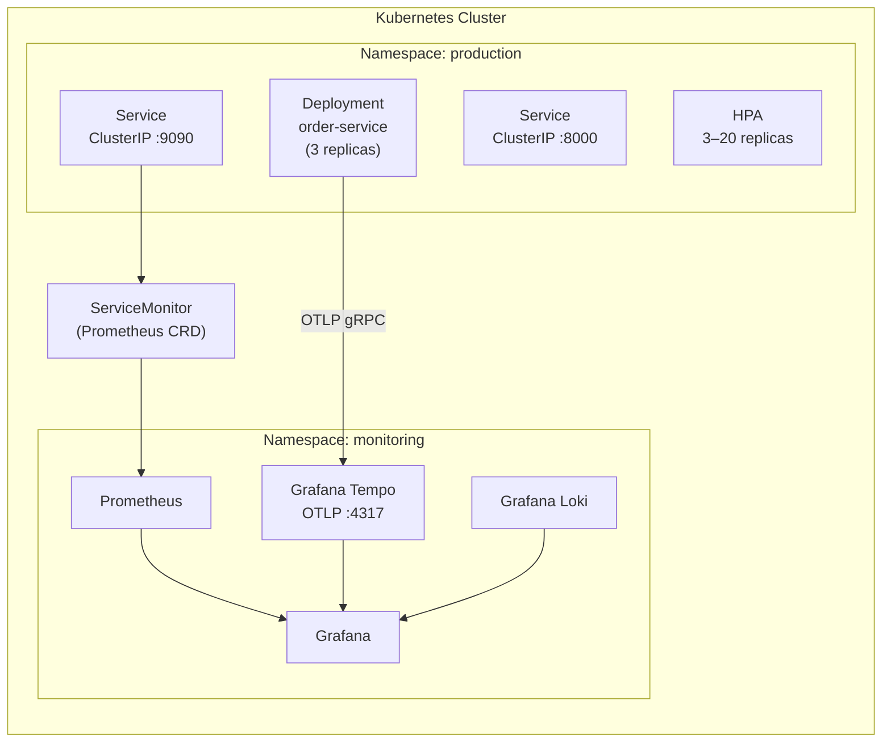

# Kubernetes Deployment Guide

This guide covers a production-grade Kubernetes deployment of a service instrumented with obskit v1.0.0. It includes manifests for ConfigMaps, Secrets, Deployments, Services, HPA, RBAC, and Prometheus ServiceMonitors.

---

## Architecture Overview



---

## 1. Namespace

```yaml
# k8s/namespace.yaml
apiVersion: v1
kind: Namespace
metadata:
  name: production
  labels:
    monitoring: enabled
```

---

## 2. ConfigMap (non-sensitive settings)

```yaml
# k8s/configmap.yaml
apiVersion: v1
kind: ConfigMap
metadata:
  name: order-service-obskit
  namespace: production
  labels:
    app: order-service
    component: config
data:
  # ── Service Identity ──────────────────────────────────────────────────────
  OBSKIT_SERVICE_NAME: "order-service"
  OBSKIT_ENVIRONMENT: "production"
  # OBSKIT_VERSION is injected per-deployment from image tag

  # ── Tracing ───────────────────────────────────────────────────────────────
  OBSKIT_TRACING_ENABLED: "true"
  OBSKIT_OTLP_ENDPOINT: "http://tempo-distributor.monitoring.svc.cluster.local:4317"
  OBSKIT_OTLP_INSECURE: "false"
  OBSKIT_TRACE_SAMPLE_RATE: "0.1"
  OBSKIT_TRACE_EXPORT_QUEUE_SIZE: "4096"
  OBSKIT_TRACE_EXPORT_BATCH_SIZE: "512"
  OBSKIT_TRACE_EXPORT_TIMEOUT: "30"

  # ── Metrics ───────────────────────────────────────────────────────────────
  OBSKIT_METRICS_ENABLED: "true"
  OBSKIT_METRICS_PORT: "9090"
  OBSKIT_METRICS_PATH: "/metrics"
  OBSKIT_METRICS_METHOD: "red"
  OBSKIT_USE_HISTOGRAM: "true"
  OBSKIT_METRICS_AUTH_ENABLED: "true"

  # ── Logging ───────────────────────────────────────────────────────────────
  OBSKIT_LOG_LEVEL: "INFO"
  OBSKIT_LOG_FORMAT: "json"
  OBSKIT_LOG_INCLUDE_TIMESTAMP: "true"
  OBSKIT_LOGGING_BACKEND: "structlog"

  # ── Health ────────────────────────────────────────────────────────────────
  OBSKIT_HEALTH_CHECK_TIMEOUT: "5.0"

  # ── Resilience ────────────────────────────────────────────────────────────
  OBSKIT_CIRCUIT_BREAKER_FAILURE_THRESHOLD: "5"
  OBSKIT_CIRCUIT_BREAKER_RECOVERY_TIMEOUT: "30.0"
  OBSKIT_CIRCUIT_BREAKER_HALF_OPEN_REQUESTS: "3"
  OBSKIT_RETRY_MAX_ATTEMPTS: "3"
  OBSKIT_RETRY_BASE_DELAY: "1.0"
  OBSKIT_RETRY_MAX_DELAY: "60.0"
```

---

## 3. Secret (sensitive credentials)

```bash
# Generate base64 values
echo -n 'your-metrics-auth-token' | base64
# → eW91ci1tZXRyaWNzLWF1dGgtdG9rZW4=
```

```yaml
# k8s/secret.yaml
apiVersion: v1
kind: Secret
metadata:
  name: order-service-obskit-secrets
  namespace: production
  labels:
    app: order-service
    component: secrets
type: Opaque
data:
  # echo -n 'token-value' | base64
  OBSKIT_METRICS_AUTH_TOKEN: "eW91ci1tZXRyaWNzLWF1dGgtdG9rZW4="
---
# For OTLP with bearer token authentication
apiVersion: v1
kind: Secret
metadata:
  name: order-service-otlp-auth
  namespace: production
type: Opaque
stringData:
  # stringData is auto-encoded by Kubernetes
  OTEL_EXPORTER_OTLP_HEADERS: "Authorization=Bearer eyJhbGci..."
```

!!! danger "Never hardcode secrets"
    Use Kubernetes Secrets, HashiCorp Vault, AWS Secrets Manager, or another secret store. The `stringData` field is a convenience; Kubernetes encodes and stores it as base64.

---

## 4. Deployment Manifest

```yaml
# k8s/deployment.yaml
apiVersion: apps/v1
kind: Deployment
metadata:
  name: order-service
  namespace: production
  labels:
    app: order-service
    version: "2.1.0"
  annotations:
    # Trigger rolling restart when ConfigMap changes (requires Reloader or manual)
    configmap.reloader.stakater.com/reload: "order-service-obskit"
spec:
  replicas: 3
  selector:
    matchLabels:
      app: order-service
  strategy:
    type: RollingUpdate
    rollingUpdate:
      maxSurge: 1
      maxUnavailable: 0          # Zero-downtime deployments
  template:
    metadata:
      labels:
        app: order-service
        version: "2.1.0"
      annotations:
        # Prometheus scrape annotations (fallback if no ServiceMonitor CRD)
        prometheus.io/scrape: "true"
        prometheus.io/port: "9090"
        prometheus.io/path: "/metrics"
    spec:
      serviceAccountName: order-service
      terminationGracePeriodSeconds: 60

      # ── Security Context ────────────────────────────────────────────────────
      securityContext:
        runAsNonRoot: true
        runAsUser: 1000
        fsGroup: 1000

      containers:
        - name: order-service
          image: ghcr.io/acme/order-service:2.1.0
          imagePullPolicy: IfNotPresent

          ports:
            - name: http
              containerPort: 8000
              protocol: TCP
            - name: metrics
              containerPort: 9090
              protocol: TCP
            - name: health
              containerPort: 8001
              protocol: TCP

          # ── Env: non-sensitive from ConfigMap ────────────────────────────────
          envFrom:
            - configMapRef:
                name: order-service-obskit
            - secretRef:
                name: order-service-obskit-secrets

          # ── Env: per-pod values injected at runtime ───────────────────────────
          env:
            - name: OBSKIT_VERSION
              valueFrom:
                fieldRef:
                  fieldPath: metadata.labels['version']
            - name: POD_NAME
              valueFrom:
                fieldRef:
                  fieldPath: metadata.name
            - name: POD_NAMESPACE
              valueFrom:
                fieldRef:
                  fieldPath: metadata.namespace
            - name: NODE_NAME
              valueFrom:
                fieldRef:
                  fieldPath: spec.nodeName

          # ── Resource Limits ───────────────────────────────────────────────────
          resources:
            requests:
              cpu: "100m"
              memory: "256Mi"
            limits:
              cpu: "1000m"
              memory: "512Mi"

          # ── Probes ────────────────────────────────────────────────────────────
          # Startup probe: give the app time to initialise before liveness kicks in
          startupProbe:
            httpGet:
              path: /health/startup
              port: health
            failureThreshold: 30
            periodSeconds: 3
            timeoutSeconds: 5

          # Liveness probe: restart if the app is deadlocked
          livenessProbe:
            httpGet:
              path: /health/live
              port: health
            initialDelaySeconds: 0
            periodSeconds: 10
            timeoutSeconds: 5
            failureThreshold: 3
            successThreshold: 1

          # Readiness probe: remove from Service endpoints if degraded
          readinessProbe:
            httpGet:
              path: /health/ready
              port: health
            initialDelaySeconds: 5
            periodSeconds: 5
            timeoutSeconds: 3
            failureThreshold: 3
            successThreshold: 1

          # ── Lifecycle ─────────────────────────────────────────────────────────
          lifecycle:
            preStop:
              exec:
                # Graceful drain: wait for in-flight requests before shutdown
                command: ["/bin/sh", "-c", "sleep 5"]

          # ── Security ──────────────────────────────────────────────────────────
          securityContext:
            allowPrivilegeEscalation: false
            readOnlyRootFilesystem: true
            capabilities:
              drop:
                - ALL

          volumeMounts:
            - name: tmp
              mountPath: /tmp

      volumes:
        - name: tmp
          emptyDir: {}

      # ── Pod Anti-Affinity ────────────────────────────────────────────────────
      affinity:
        podAntiAffinity:
          preferredDuringSchedulingIgnoredDuringExecution:
            - weight: 100
              podAffinityTerm:
                labelSelector:
                  matchExpressions:
                    - key: app
                      operator: In
                      values:
                        - order-service
                topologyKey: kubernetes.io/hostname
```

---

## 5. Services

```yaml
# k8s/services.yaml
---
# Application traffic
apiVersion: v1
kind: Service
metadata:
  name: order-service
  namespace: production
  labels:
    app: order-service
spec:
  selector:
    app: order-service
  ports:
    - name: http
      port: 80
      targetPort: http
      protocol: TCP
  type: ClusterIP
---
# Metrics scraping (separate Service for ServiceMonitor)
apiVersion: v1
kind: Service
metadata:
  name: order-service-metrics
  namespace: production
  labels:
    app: order-service
    monitoring: "true"
spec:
  selector:
    app: order-service
  ports:
    - name: metrics
      port: 9090
      targetPort: metrics
      protocol: TCP
  type: ClusterIP
```

---

## 6. Horizontal Pod Autoscaler

```yaml
# k8s/hpa.yaml
apiVersion: autoscaling/v2
kind: HorizontalPodAutoscaler
metadata:
  name: order-service
  namespace: production
spec:
  scaleTargetRef:
    apiVersion: apps/v1
    kind: Deployment
    name: order-service
  minReplicas: 3
  maxReplicas: 20
  metrics:
    # ── CPU utilisation ───────────────────────────────────────────────────────
    - type: Resource
      resource:
        name: cpu
        target:
          type: Utilization
          averageUtilization: 70

    # ── Memory utilisation ────────────────────────────────────────────────────
    - type: Resource
      resource:
        name: memory
        target:
          type: Utilization
          averageUtilization: 80

    # ── Custom metric: HTTP request rate from Prometheus ──────────────────────
    # Requires prometheus-adapter or KEDA
    - type: Pods
      pods:
        metric:
          name: http_requests_per_second
        target:
          type: AverageValue
          averageValue: "100"

  behavior:
    scaleUp:
      stabilizationWindowSeconds: 60
      policies:
        - type: Pods
          value: 2
          periodSeconds: 60
    scaleDown:
      stabilizationWindowSeconds: 300   # 5-min cooldown before scale-down
      policies:
        - type: Pods
          value: 1
          periodSeconds: 120
```

---

## 7. RBAC for Metrics Scraping

```yaml
# k8s/rbac.yaml
---
apiVersion: v1
kind: ServiceAccount
metadata:
  name: order-service
  namespace: production
  labels:
    app: order-service
---
apiVersion: rbac.authorization.k8s.io/v1
kind: ClusterRole
metadata:
  name: prometheus-metrics-reader
rules:
  - nonResourceURLs:
      - /metrics
    verbs:
      - get
---
apiVersion: rbac.authorization.k8s.io/v1
kind: ClusterRoleBinding
metadata:
  name: prometheus-metrics-reader
roleRef:
  apiGroup: rbac.authorization.k8s.io
  kind: ClusterRole
  name: prometheus-metrics-reader
subjects:
  - kind: ServiceAccount
    name: prometheus
    namespace: monitoring
```

---

## 8. Prometheus ServiceMonitor CRD

Requires the **Prometheus Operator** (`kube-prometheus-stack` Helm chart).

```yaml
# k8s/servicemonitor.yaml
apiVersion: monitoring.coreos.com/v1
kind: ServiceMonitor
metadata:
  name: order-service
  namespace: monitoring           # Prometheus operator namespace
  labels:
    app: order-service
    release: kube-prometheus-stack  # Must match Prometheus selector
spec:
  namespaceSelector:
    matchNames:
      - production
  selector:
    matchLabels:
      app: order-service
      monitoring: "true"
  endpoints:
    - port: metrics
      path: /metrics
      interval: 15s
      scrapeTimeout: 10s
      # Uncomment if OBSKIT_METRICS_AUTH_ENABLED=true
      # bearerTokenSecret:
      #   name: order-service-obskit-secrets
      #   key: OBSKIT_METRICS_AUTH_TOKEN
      relabelings:
        - sourceLabels: [__meta_kubernetes_pod_name]
          targetLabel: pod
        - sourceLabels: [__meta_kubernetes_namespace]
          targetLabel: namespace
        - sourceLabels: [__meta_kubernetes_pod_node_name]
          targetLabel: node
      metricRelabelings:
        # Drop high-cardinality internal metrics in scrape
        - sourceLabels: [__name__]
          regex: "go_.*"
          action: drop
```

---

## 9. Ingress

```yaml
# k8s/ingress.yaml
apiVersion: networking.k8s.io/v1
kind: Ingress
metadata:
  name: order-service
  namespace: production
  annotations:
    nginx.ingress.kubernetes.io/rewrite-target: /
    # HTTPS redirect
    nginx.ingress.kubernetes.io/ssl-redirect: "true"
    # Request tracing header propagation
    nginx.ingress.kubernetes.io/configuration-snippet: |
      proxy_set_header X-Request-ID $request_id;
      proxy_set_header traceparent $http_traceparent;
      proxy_set_header tracestate $http_tracestate;
spec:
  ingressClassName: nginx
  tls:
    - hosts:
        - api.acme.com
      secretName: acme-tls
  rules:
    - host: api.acme.com
      http:
        paths:
          - path: /
            pathType: Prefix
            backend:
              service:
                name: order-service
                port:
                  name: http
```

---

## 10. Istio / Envoy Compatibility

obskit is fully compatible with Istio service meshes. Key points:

- **W3C Trace Context**: obskit propagates `traceparent` / `tracestate` headers, which Envoy / Istio understands natively.
- **mTLS**: Istio can handle mTLS between services. Set `OBSKIT_OTLP_INSECURE=false` and let Istio's sidecar terminate TLS to the collector.
- **Metrics port exclusion**: Add the metrics port to `traffic.sidecar.istio.io/excludeOutboundPorts` annotation so Envoy does not intercept Prometheus scrapes.

```yaml
metadata:
  annotations:
    # Exclude metrics port from Envoy proxy
    traffic.sidecar.istio.io/excludeInboundPorts: "9090"
    # Propagate trace context headers
    sidecar.istio.io/inject: "true"
```

---

## 11. Sidecar OTLP Collector Pattern

For environments where you cannot reach a central Tempo endpoint directly, deploy an **OpenTelemetry Collector** sidecar that batches and forwards traces:

```yaml
# In the Deployment spec, under spec.template.spec.containers:
- name: otel-collector
  image: otel/opentelemetry-collector-contrib:0.95.0
  args:
    - "--config=/conf/collector.yaml"
  ports:
    - containerPort: 4317   # OTLP gRPC (receive from app)
    - containerPort: 8888   # Collector self-metrics
  volumeMounts:
    - name: otel-config
      mountPath: /conf
  resources:
    requests:
      cpu: 50m
      memory: 64Mi
    limits:
      cpu: 200m
      memory: 256Mi

# In spec.template.spec.volumes:
- name: otel-config
  configMap:
    name: otel-collector-config
```

```yaml
# k8s/otel-collector-configmap.yaml
apiVersion: v1
kind: ConfigMap
metadata:
  name: otel-collector-config
  namespace: production
data:
  collector.yaml: |
    receivers:
      otlp:
        protocols:
          grpc:
            endpoint: 0.0.0.0:4317

    processors:
      batch:
        timeout: 5s
        send_batch_size: 512
      memory_limiter:
        check_interval: 1s
        limit_mib: 200

    exporters:
      otlp:
        endpoint: "tempo-distributor.monitoring.svc.cluster.local:4317"
        tls:
          insecure: false
          cert_file: /var/run/secrets/tls/tls.crt
          key_file: /var/run/secrets/tls/tls.key

    service:
      pipelines:
        traces:
          receivers: [otlp]
          processors: [memory_limiter, batch]
          exporters: [otlp]
```

When using the sidecar pattern, set:

```yaml
OBSKIT_OTLP_ENDPOINT: "http://localhost:4317"   # sidecar is local
OBSKIT_OTLP_INSECURE: "true"                    # pod-local is fine
```

---

## 12. Grafana Dashboard Import

obskit ships pre-built Grafana dashboards. Import them via the Grafana API or ConfigMap:

```yaml
# k8s/grafana-dashboard-configmap.yaml
apiVersion: v1
kind: ConfigMap
metadata:
  name: obskit-grafana-dashboards
  namespace: monitoring
  labels:
    grafana_dashboard: "1"       # picked up by Grafana sidecar
data:
  obskit-red-metrics.json: |
    {
      "title": "obskit — RED Metrics",
      "uid": "obskit-red",
      ...
    }
  obskit-slo.json: |
    {
      "title": "obskit — SLO Burn Rate",
      "uid": "obskit-slo",
      ...
    }
```

Or import interactively:

1. Open Grafana → **Dashboards** → **Import**
2. Paste the dashboard JSON from the obskit repository at `dashboards/`
3. Select your Prometheus data source

---

## 13. Health Check Probe Implementation

Your FastAPI/Flask app should expose separate health paths so Kubernetes probes can distinguish startup from runtime health:

```python
# app/health.py
from fastapi import FastAPI, Response
from obskit.health import HealthChecker

app = FastAPI()
checker = HealthChecker()

@app.get("/health/live")
async def liveness():
    """Returns 200 unless the process is in a fatal state."""
    return {"status": "alive"}

@app.get("/health/ready")
async def readiness():
    """Returns 200 only when all dependencies are reachable."""
    result = await checker.check_all()
    if result.is_healthy:
        return {"status": "ready", "checks": result.details}
    return Response(
        content=result.model_dump_json(),
        status_code=503,
        media_type="application/json",
    )

@app.get("/health/startup")
async def startup():
    """Returns 200 once the app has finished initialising."""
    # Check database migrations, cache warm-up, etc.
    return {"status": "started"}
```

---

## 14. PodDisruptionBudget

Prevent too many pods from being evicted simultaneously during node maintenance:

```yaml
# k8s/pdb.yaml
apiVersion: policy/v1
kind: PodDisruptionBudget
metadata:
  name: order-service
  namespace: production
spec:
  selector:
    matchLabels:
      app: order-service
  minAvailable: 2    # Always keep at least 2 pods running
```

---

## 15. Complete Apply Order

```bash
# Apply in dependency order
kubectl apply -f k8s/namespace.yaml
kubectl apply -f k8s/rbac.yaml
kubectl apply -f k8s/configmap.yaml
kubectl apply -f k8s/secret.yaml
kubectl apply -f k8s/otel-collector-configmap.yaml
kubectl apply -f k8s/deployment.yaml
kubectl apply -f k8s/services.yaml
kubectl apply -f k8s/ingress.yaml
kubectl apply -f k8s/hpa.yaml
kubectl apply -f k8s/pdb.yaml
kubectl apply -f k8s/servicemonitor.yaml

# Verify rollout
kubectl rollout status deployment/order-service -n production

# Check pods
kubectl get pods -n production -l app=order-service

# Check metrics endpoint
kubectl port-forward svc/order-service-metrics 9090:9090 -n production &
curl http://localhost:9090/metrics | head -20
```

---

!!! tip "Cost optimisation"
    Tempo's local storage backend is fine for clusters with up to ~10 GB/day of trace data. For larger volumes, switch to an object store backend (S3, GCS) in the Tempo Helm values.

!!! warning "Production readiness for Tempo"
    The `helm install tempo grafana/tempo` command deploys a single-node Tempo instance. For production, use the `grafana/tempo-distributed` chart which separates ingestion, querying, and compaction into independent scalable components.

!!! info "kube-prometheus-stack includes Grafana"
    You do not need a separate Grafana installation. The `kube-prometheus-stack` chart bundles Grafana, Prometheus, and Alertmanager. Datasource ConfigMaps with the label `grafana_datasource: "1"` are picked up automatically by the Grafana sidecar.

---

## Verify Trace–Log Correlation

After deploying, confirm the full correlation chain is working:

=== "Step 1: Create a request"

    ```bash
    kubectl port-forward -n production svc/order-service 8000:80 &
    TRACE_RESPONSE=$(curl -s -X POST http://localhost:8000/orders/ \
      -H "Content-Type: application/json" \
      -d '{"items": [{"sku": "TEST", "quantity": 1, "unit_price": 5.0}]}')
    echo "$TRACE_RESPONSE"
    ```

=== "Step 2: Find the trace_id in logs"

    ```bash
    # Tail logs and extract the trace_id
    kubectl logs -n production -l app=order-service --tail=10 | \
      python3 -c "import sys, json
    for line in sys.stdin:
        try:
            d = json.loads(line)
            if 'trace_id' in d:
                print('trace_id:', d['trace_id'])
        except: pass"
    ```

=== "Step 3: Look up the trace in Grafana"

    1. Open Grafana → **Explore** → select **Loki**
    2. Query: `{namespace="production", app="order-service"} | json | trace_id != ""`
    3. Click the `trace_id` value in any log line → jumps to **Tempo** trace view
    4. The full trace tree shows every span including `payment.charge`
