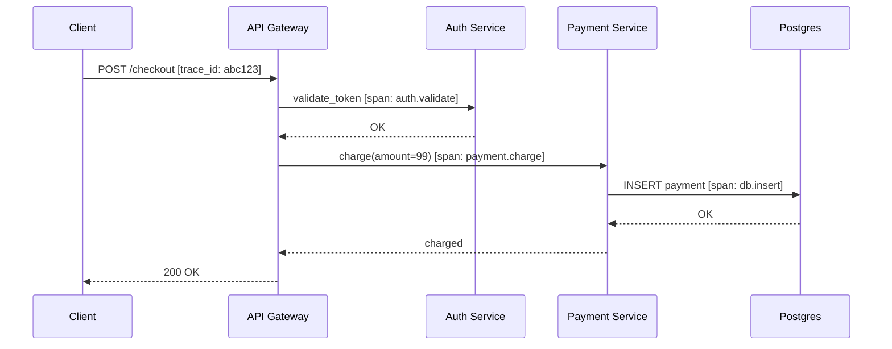
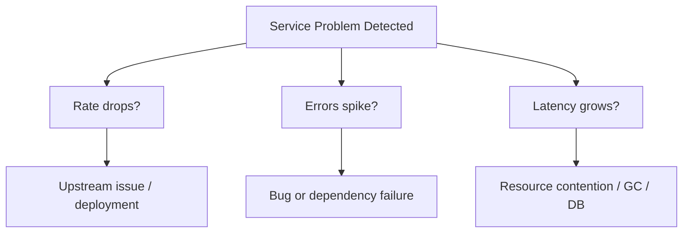
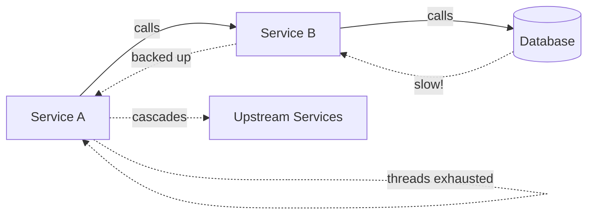
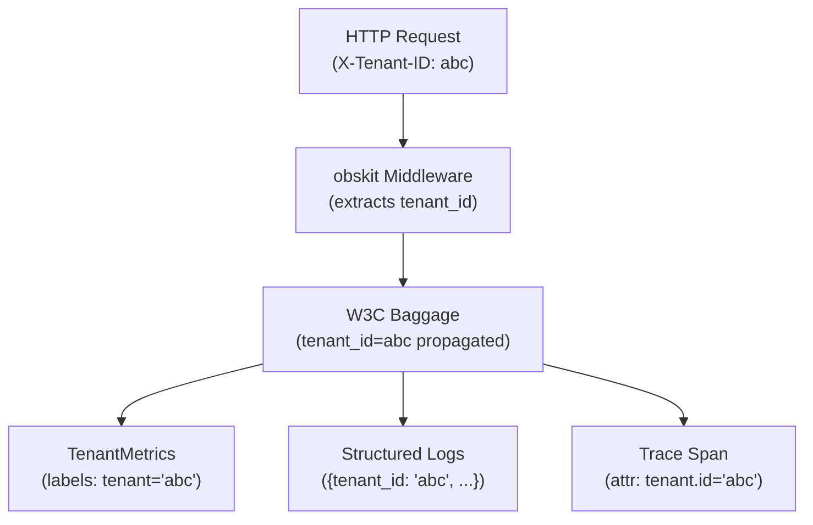
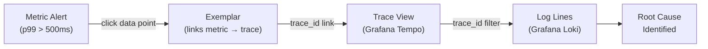

# Observability Concepts

This guide covers the foundational concepts behind obskit's design — understanding *why* these patterns exist before you write a single line of code makes everything else click into place.

---

## Monitoring vs Observability

These two words are often used interchangeably but they describe fundamentally different postures.

**Monitoring** answers the question *"did something break?"* You define thresholds in advance, set up dashboards, and wait for alerts to fire. Monitoring is reactive and works well when your system's failure modes are already understood.

**Observability** answers the question *"why is it behaving this way?"* An observable system lets you explore any question about its internal state from the outside — even questions you never thought to ask when you built it. Observability is exploratory and works well in complex distributed systems where novel failure modes emerge constantly.

```
Monitoring                Observability
──────────                ─────────────
Known unknowns            Unknown unknowns
Dashboards + alerts       Exploration + interrogation
"Is X above threshold?"   "Why is latency high for tenant ABC?"
Passive                   Active investigation
```

!!! tip "The practical difference"
    If your on-call engineer can answer *any* question about system state by querying logs, metrics, and traces — without deploying new code — your system is observable. If they can only check dashboards you built months ago, it is merely monitored.

obskit provides all three signals (metrics, logs, traces) with automatic correlation so you can move seamlessly between them during an incident.

---

## The Three Pillars

### Metrics

Metrics are **numeric time-series** — a stream of `(timestamp, value)` pairs with associated labels. They are cheap to store, easy to alert on, and perfect for dashboards.

**Strengths:**
- Very low overhead (a Prometheus counter increment is ~100 ns)
- Aggregatable across instances and time windows
- Excellent for alerting (clear threshold semantics)
- Long retention (years at low cost)

**Weaknesses:**
- No context — a spike in error rate tells you *that* something is wrong, not *why*
- High-cardinality labels cause memory/performance problems (see [Cardinality Management](metrics.md#cardinality-management))

**obskit example:**

```python
from obskit.metrics.red import REDMetrics

red = REDMetrics(service="payment-service")
red.record_request(method="POST", endpoint="/charge", duration=0.142)
red.record_error(method="POST", endpoint="/charge", error_type="timeout")
```

### Logs

Logs are **discrete events** with a timestamp, severity, and structured payload. They provide the richest context of the three pillars.

**Strengths:**
- Unlimited detail — attach any context to any event
- Natural fit for debugging ("what happened at 14:32:07?")
- Easy to search with a log aggregator (Loki, Elasticsearch, Splunk)

**Weaknesses:**
- High volume at scale — naively logging every request creates storage pressure
- Unstructured text logs are hard to query reliably

**obskit uses structured (JSON) logs via structlog:**

```python
from obskit.logging import get_logger

log = get_logger(__name__)
log.info("payment.charged", amount=9900, currency="USD", user_id="u_abc123")
```

JSON output:
```json
{
  "timestamp": "2026-02-28T14:32:07.841Z",
  "level": "info",
  "event": "payment.charged",
  "amount": 9900,
  "currency": "USD",
  "user_id": "u_abc123",
  "service": "payment-service",
  "trace_id": "4bf92f3577b34da6a3ce929d0e0e4736",
  "span_id": "00f067aa0ba902b7"
}
```

The `trace_id` and `span_id` are injected **automatically** when an OpenTelemetry span is active — this is trace-log correlation, covered in depth in the [Logging guide](logging.md).

### Traces

Traces represent the **end-to-end lifecycle of a single request** as it flows through your distributed system. Each trace is a tree of *spans*, where each span represents a unit of work (an HTTP call, a database query, a cache lookup).

**Strengths:**
- Shows the exact path of a request across service boundaries
- Makes latency attribution trivial ("the DB query took 800 ms, everything else was fast")
- Essential for debugging distributed systems

**Weaknesses:**
- High volume — tracing every request at full fidelity is expensive
- Requires instrumentation across all services



**obskit example:**

```python
from obskit.tracing import trace_span

with trace_span("payment.charge", attributes={"amount": 9900, "currency": "USD"}) as span:
    result = charge_card(amount=9900)
    span.set_attribute("payment.id", result.id)
```

---

## The RED Method

RED stands for **Rate, Errors, Duration**. It is the canonical method for understanding **request-driven services** (APIs, microservices that handle user requests).

| Signal   | Definition                                       | Prometheus metric type |
|----------|--------------------------------------------------|------------------------|
| Rate     | Requests per second your service is handling     | Counter                |
| Errors   | Fraction of requests that fail                   | Counter                |
| Duration | Distribution of response time for all requests   | Histogram              |

### Why RED?

If your service is performing well, all three signals are healthy simultaneously:
- Rate is at expected levels (not a traffic anomaly)
- Error rate is near zero
- p99 latency is within SLO bounds

When something goes wrong, RED tells you *what kind* of problem it is:
- Rate drops → traffic not reaching the service (upstream issue, deployment, DNS)
- Error rate spikes → bugs, dependency failures, resource exhaustion
- Latency grows → database slowdown, lock contention, GC pressure



### obskit REDMetrics

```python
from obskit.metrics.red import REDMetrics

red = REDMetrics(service="api-gateway", namespace="myapp")

# In your request handler:
import time
start = time.perf_counter()
try:
    result = handle_request(req)
    red.record_request(
        method=req.method,
        endpoint=req.path,
        status_code=200,
        duration=time.perf_counter() - start,
    )
except Exception as exc:
    red.record_error(
        method=req.method,
        endpoint=req.path,
        error_type=type(exc).__name__,
    )
    raise
```

---

## The Four Golden Signals

Google's Site Reliability Engineering book defines **four golden signals** that are sufficient to describe the health of any user-facing service:

| Signal      | Description                                            |
|-------------|--------------------------------------------------------|
| Latency     | Time to serve a request (distinguish success vs error) |
| Traffic     | Demand on the system (RPS, transactions/sec)           |
| Errors      | Rate of failed requests (explicit 5xx and implicit)    |
| Saturation  | How "full" the service is (CPU, memory, queue depth)   |

!!! note "RED vs Golden Signals"
    RED and Golden Signals overlap significantly. The key addition in Golden Signals is **Saturation** — a leading indicator. Saturation often predicts problems before they manifest as latency or errors.

### obskit GoldenSignals

```python
from obskit.metrics.golden import GoldenSignals

gs = GoldenSignals(service="recommendation-engine")

# Record request outcome
gs.record_request(endpoint="/recommend", duration=0.054, success=True)

# Record saturation (e.g., from a background loop)
gs.record_saturation(
    resource="worker_pool",
    utilization=0.87,   # 87% workers busy
)
```

---

## The USE Method

USE stands for **Utilization, Saturation, Errors**. It was designed by Brendan Gregg for **infrastructure resources** (CPUs, disks, network interfaces, thread pools, connection pools).

| Signal      | Definition                                                          |
|-------------|---------------------------------------------------------------------|
| Utilization | Average time a resource is busy (percentage)                        |
| Saturation  | Degree to which the resource has extra work queued (queue depth)    |
| Errors      | Count of error events (disk I/O errors, packet drops, etc.)        |

!!! info "When to use USE vs RED"
    - **RED** for services that handle requests (APIs, gRPCs)
    - **USE** for resources those services depend on (databases, caches, thread pools, CPUs)

    Apply **both** and you get a complete picture: RED shows user-facing impact, USE explains the root cause.

### obskit USEMetrics

```python
from obskit.metrics.use import USEMetrics

use = USEMetrics(resource="db_connection_pool", namespace="myapp")

# Periodically (e.g., every 15 seconds):
pool_stats = get_pool_stats()
use.record(
    utilization=pool_stats.active / pool_stats.total,
    saturation=pool_stats.waiting,
    errors=pool_stats.connection_errors_since_last,
)
```

---

## SLOs and Error Budgets

### Service Level Objectives

An **SLO** is a target for service reliability, expressed as a ratio over a time window. For example:

> *"99.9% of requests to `/checkout` will complete in under 500 ms, measured over a 30-day rolling window."*

SLOs bridge the gap between engineering and the business:
- Too strict → engineers spend all their time on reliability, no feature work
- Too loose → users experience unacceptable degradation

### Error Budgets

The **error budget** is `1 - SLO`. If your availability SLO is 99.9%, your error budget is 0.1% — roughly 43 minutes of downtime per month.

Error budget as a concept changes team culture:
- When budget is healthy → ship fast, take risks, run experiments
- When budget is nearly exhausted → freeze risky deployments, focus on reliability
- When budget is depleted → mandatory reliability sprint

```
Error Budget = 1 - SLO target
Monthly budget @ 99.9% = 43.8 minutes of allowed downtime

Week 1: 5 min incident   → 38.8 min remaining
Week 2: 12 min incident  → 26.8 min remaining  (slow down!)
Week 3: 28 min incident  → budget EXHAUSTED     (freeze deployments)
```

### obskit SLOTracker

```python
from obskit.slo import SLOTracker, SLOWindow

tracker = SLOTracker(
    name="checkout_availability",
    objective=0.999,
    windows=[SLOWindow.HOUR, SLOWindow.DAY, SLOWindow.WEEK, SLOWindow.MONTH],
)

tracker.record_success()
tracker.record_failure(error_type="timeout")

report = tracker.get_report()
print(f"Current SLI: {report['sli']:.4%}")
print(f"Error budget remaining: {report['budget_remaining']:.1%}")
```

See the full [SLO guide](slo.md) for alert rule generation and Grafana integration.

---

## Distributed Tracing Deep Dive

### Why Tracing Matters

In a monolith, a slow request is debuggable with logs and a profiler. In microservices, a slow request might span 15 services and 40 network hops. Without tracing, the only way to debug it is to grep logs across every service and correlate timestamps manually.

Tracing solves this by propagating a `trace_id` with every request. Every service that participates in handling that request creates a **span** that is associated with the same trace. At the end, you can visualize the entire call tree.

### Trace Context Propagation

obskit uses the **W3C TraceContext** standard (`traceparent` / `tracestate` headers) for propagation. This is the industry standard and is compatible with Jaeger, Tempo, Zipkin, AWS X-Ray, and Google Cloud Trace.

```
traceparent: 00-4bf92f3577b34da6a3ce929d0e0e4736-00f067aa0ba902b7-01
             │  │                                │                │
             │  trace_id (128-bit hex)           span_id (64-bit) │
             version                                              flags (sampled=1)
```

### Trace Visualization

```mermaid
gantt
    title Trace: checkout (trace_id: 4bf92f35...)
    dateFormat x
    axisFormat %Lms

    section api-gateway
    checkout handler     :0, 380

    section auth-service
    validate_token       :5, 45

    section payment-service
    charge               :55, 310

    section postgres
    db.query (SELECT)    :60, 20
    db.query (INSERT)    :85, 180
```



### Adaptive Sampling

Tracing every request at scale is expensive. obskit supports **adaptive sampling** via OpenTelemetry's `TraceIdRatioBased` sampler, optionally combined with `ParentBased` to honour upstream sampling decisions.

```python
from obskit.tracing import setup_tracing

setup_tracing(
    exporter_endpoint="http://tempo:4317",
    sample_rate=0.1,    # Sample 10% of traces
)
```

!!! warning "Always sample errors"
    Standard ratio-based sampling may discard error traces. obskit's middleware automatically marks error spans to ensure they are preserved regardless of the global sample rate.

---

## Structured Logging

### Why JSON over Plaintext

Plain text log lines look friendly in a terminal but are a nightmare at scale:
- You cannot reliably extract fields with regex (values contain commas, quotes, newlines)
- Log aggregators cannot index them efficiently
- Correlation with traces requires embedding `trace_id=...` in the message string and hoping nobody changes the format

JSON logs solve all of this:

=== "Plaintext (bad)"
    ```
    2026-02-28 14:32:07 ERROR payment-service Failed to charge card for user u_abc123: timeout after 30s
    ```
    Extracting `user_id` requires regex. `trace_id` is absent. Grepping works until the message format changes.

=== "Structured JSON (good)"
    ```json
    {
      "timestamp": "2026-02-28T14:32:07Z",
      "level": "error",
      "event": "payment.charge_failed",
      "user_id": "u_abc123",
      "error": "timeout",
      "duration_ms": 30000,
      "trace_id": "4bf92f3577b34da6a3ce929d0e0e4736",
      "span_id": "00f067aa0ba902b7"
    }
    ```
    Every field is queryable. Loki/Elasticsearch index them natively. `trace_id` links directly to Grafana Tempo.

### Field Naming Conventions

obskit follows the **OpenTelemetry Semantic Conventions** for log field names:

| Field            | Convention           | Example                        |
|------------------|----------------------|--------------------------------|
| Service name     | `service.name`       | `"payment-service"`            |
| HTTP method      | `http.method`        | `"POST"`                       |
| HTTP status      | `http.status_code`   | `200`                          |
| DB system        | `db.system`          | `"postgresql"`                 |
| Error type       | `exception.type`     | `"TimeoutError"`               |
| User ID          | `enduser.id`         | `"u_abc123"`                   |

---

## Circuit Breakers

### The Cascading Failure Problem

Imagine Service A calls Service B. Service B starts responding slowly (perhaps its database is under load). Service A's threads start accumulating, each waiting for B to respond. Eventually A runs out of threads and starts refusing requests. Now all services upstream of A are also failing — a cascading failure.



### Circuit Breaker Pattern

A circuit breaker wraps calls to a dependency. It tracks failure rates and, when they exceed a threshold, **opens** the circuit — immediately failing fast instead of waiting for the dependency to time out.

```
CLOSED → (failure threshold exceeded) → OPEN
OPEN   → (timeout elapsed)            → HALF-OPEN
HALF-OPEN → (probe succeeds)          → CLOSED
HALF-OPEN → (probe fails)             → OPEN
```

**States:**
- **Closed**: Normal operation. All calls pass through.
- **Open**: Dependency is failing. Calls fail immediately (no network call).
- **Half-Open**: Testing if the dependency has recovered. One probe call allowed.

```python
from obskit.resilience import CircuitBreaker

cb = CircuitBreaker(
    name="payment-gateway",
    failure_threshold=5,
    recovery_timeout=30.0,
)

@cb
async def call_payment_gateway(amount: int):
    return await gateway.charge(amount)
```

See the [Resilience guide](resilience.md) for retry strategies and rate limiting.

---

## PII Redaction

### Compliance Requirements

Personal Identifiable Information (PII) must not appear in logs, metrics labels, or trace attributes:

- **GDPR** (EU): Requires data minimisation and purpose limitation. Logging an email address when you only needed to log a request outcome is a violation.
- **CCPA** (California): Similar requirements for California residents.
- **PCI-DSS**: Credit card numbers must never appear in logs.
- **HIPAA**: Health information requires strict access controls.

obskit provides automatic PII detection and redaction so compliance is the default, not an afterthought.

```python
# Without obskit PII protection — dangerous:
log.info("user.login", email="alice@example.com", password="hunter2")  # never do this

# With obskit PII redaction configured:
log.info("user.login", email="alice@example.com")
# Output: {"event": "user.login", "email": "[REDACTED]", ...}
```

See the [PII guide](pii.md) for configuration details.

---

## Multi-Tenancy

In a SaaS system, a single deployment serves multiple tenants. Observability must reflect this:

- **Per-tenant metrics**: Is tenant ABC's p99 latency within SLO? Is tenant XYZ consuming disproportionate resources?
- **Per-tenant logs**: Filter all logs for a specific tenant to debug their issue without noise from others.
- **Per-tenant traces**: Trace a specific tenant's request flow.

obskit propagates tenant IDs via W3C Baggage (a mechanism for propagating key-value context alongside trace context) and exposes `TenantMetrics` for isolated metric collection.

```python
from obskit.metrics.tenant import TenantMetrics

tenant_metrics = TenantMetrics(service="api")
tenant_metrics.record_request(tenant_id="tenant_abc", endpoint="/api/data", duration=0.023)
```



See the [Multi-tenancy guide](multi-tenancy.md) for full configuration.

---

## How the Pillars Correlate

The real power of obskit emerges when all three pillars are connected:

1. A **metric** alert fires: `p99_latency > 500ms` for the `checkout` endpoint.
2. You open Grafana, click the metric data point, and follow the **exemplar** link to a specific trace.
3. The **trace** shows that `db.INSERT` in the `payment-service` took 480 ms.
4. You click "Logs for this trace" in Grafana — Loki filters logs by `trace_id`.
5. The **log** shows `"db.slow_query": true, "query": "INSERT INTO payments ..."` with a lock wait of 450 ms.
6. Root cause identified in under 2 minutes.



obskit makes this workflow possible out of the box — trace IDs are automatically injected into logs, exemplars link metrics to traces, and all three signals share the same `service.name` label for easy correlation in Grafana.

---

## Next Steps

| Topic | Guide |
|---|---|
| Collecting metrics (RED, USE, Golden Signals) | [Metrics](metrics.md) |
| Distributed tracing with OpenTelemetry | [Tracing](tracing.md) |
| Structured logging with trace correlation | [Logging](logging.md) |
| Kubernetes health probes | [Health Checks](health-checks.md) |
| Circuit breakers and retry | [Resilience](resilience.md) |
| SLOs and error budgets | [SLO Tracking](slo.md) |
| GDPR-compliant PII redaction | [PII Redaction](pii.md) |
| Per-tenant observability | [Multi-Tenancy](multi-tenancy.md) |
