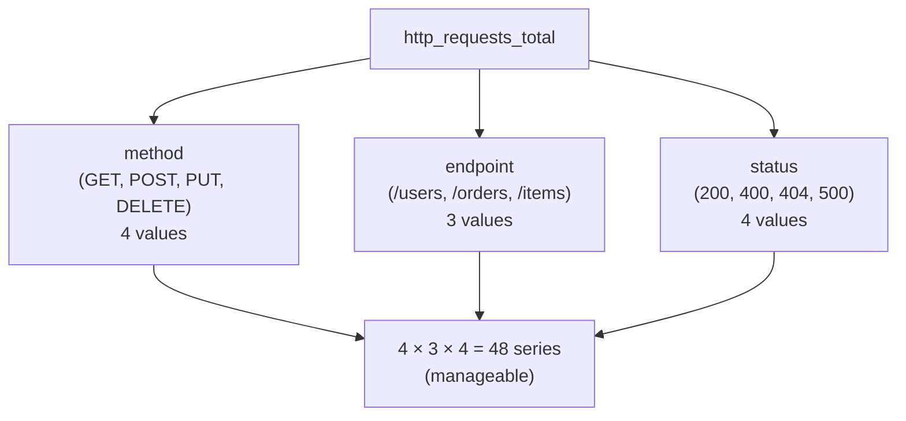

# Metrics

obskit provides a layered metrics API built on top of `prometheus_client`. You choose the abstraction level that fits your need: opinionated RED/USE/Golden-Signals collectors for common patterns, or raw Prometheus primitives when you need full control.

---

## Quick Start

```python
from obskit.metrics.red import REDMetrics

red = REDMetrics(service="my-service")
red.record_request(method="GET", endpoint="/users", duration=0.042, status_code=200)
red.record_error(method="GET", endpoint="/users", error_type="DatabaseError")
```

That's it — a Histogram and two Counters are registered in the default Prometheus registry and will be scraped at `/metrics`.

---

## RED Method

The **Rate–Errors–Duration** method is the recommended starting point for any request-handling service.

### REDMetrics API

```python
from obskit.metrics.red import REDMetrics

red = REDMetrics(
    service="payment-service",   # Becomes a label on all metrics
    namespace="myapp",           # Optional Prometheus namespace prefix
)
```

#### `record_request()`

Records a completed request — increments the rate counter and observes the duration histogram.

```python
red.record_request(
    method="POST",          # HTTP method or RPC method name
    endpoint="/charge",     # Route pattern (not raw URL — avoid high cardinality)
    duration=0.142,         # Seconds (float)
    status_code=200,        # HTTP status or gRPC status code
)
```

Generated metrics:

| Metric name | Type | Description |
|---|---|---|
| `myapp_requests_total` | Counter | Total requests, labelled by method, endpoint, status |
| `myapp_request_duration_seconds` | Histogram | Latency distribution |

#### `record_error()`

Increments the error counter separately so error rate can be computed independently of status codes.

```python
red.record_error(
    method="POST",
    endpoint="/charge",
    error_type="PaymentGatewayTimeout",  # Exception class name or custom category
)
```

### FastAPI integration

obskit's FastAPI middleware wires RED metrics automatically:

```python
from fastapi import FastAPI
from obskit.middleware.fastapi import ObskitMiddleware
from obskit.metrics.red import REDMetrics

app = FastAPI()
red = REDMetrics(service="api")

app.add_middleware(ObskitMiddleware, red_metrics=red)
```

Every request is timed and recorded with zero boilerplate.

---

## prometheus_client Integration

obskit is built on `prometheus_client` and exposes the full API. You can mix obskit collectors with raw Prometheus primitives in the same registry.

### Histograms

```python
from prometheus_client import Histogram

# Custom buckets for a payment processing service
payment_duration = Histogram(
    "payment_processing_duration_seconds",
    "Time to process a payment",
    labelnames=["gateway", "currency"],
    buckets=[0.05, 0.1, 0.25, 0.5, 1.0, 2.5, 5.0, 10.0, 30.0],
)

payment_duration.labels(gateway="stripe", currency="USD").observe(0.234)
```

!!! tip "Choose buckets deliberately"
    Default Prometheus buckets (`[.005, .01, .025, .05, .1, .25, .5, 1, 2.5, 5, 10]`) work for most web APIs. For slower operations (video processing, ML inference, batch jobs), shift your buckets to the right. For very fast operations (cache hits, in-memory lookups), add sub-millisecond buckets.

### Counters

```python
from prometheus_client import Counter

cache_ops = Counter(
    "cache_operations_total",
    "Cache operation counts",
    labelnames=["operation", "result"],   # operation=get/set/delete, result=hit/miss/error
)

cache_ops.labels(operation="get", result="hit").inc()
cache_ops.labels(operation="get", result="miss").inc()
```

### Gauges

```python
from prometheus_client import Gauge

active_websockets = Gauge(
    "active_websocket_connections",
    "Number of currently open WebSocket connections",
    labelnames=["tenant"],
)

# In connection handler:
active_websockets.labels(tenant=tenant_id).inc()
# In disconnect handler:
active_websockets.labels(tenant=tenant_id).dec()
```

### Info and Enum

```python
from prometheus_client import Info, Enum

# Build-time metadata (version, git SHA)
build_info = Info("myapp_build", "Build information")
build_info.info({"version": "2.0.0", "git_sha": "abc1234", "python": "3.12"})

# State machine state
circuit_state = Enum(
    "payment_circuit_state",
    "Circuit breaker state",
    states=["closed", "open", "half_open"],
)
circuit_state.state("closed")
```

---

## Exemplars: Linking Metrics to Traces

An **exemplar** is a sample data point stored alongside a Prometheus histogram or counter that carries a trace ID. When you click a metric data point in Grafana, the exemplar takes you directly to the trace for that specific request.

```python
from obskit.metrics import observe_with_exemplar, get_trace_exemplar
from prometheus_client import Histogram

request_duration = Histogram(
    "http_request_duration_seconds",
    "HTTP request duration",
    labelnames=["method", "endpoint"],
)

def handle_request(method, endpoint, duration):
    # observe_with_exemplar automatically attaches the current OTel trace_id
    observe_with_exemplar(
        histogram=request_duration.labels(method=method, endpoint=endpoint),
        value=duration,
    )
```

You can also retrieve the exemplar dict manually for custom use:

```python
exemplar = get_trace_exemplar()
# Returns: {"trace_id": "4bf92f3577b34da6a3ce929d0e0e4736", "span_id": "00f067aa0ba902b7"}
# Returns: {} when no OTel span is active
```

!!! note "OpenMetrics required"
    Exemplars are part of the **OpenMetrics** format, not classic Prometheus text format. Grafana's Prometheus data source supports exemplars when you enable the OpenMetrics scrape format in Prometheus (`--enable-feature=exemplar-storage`).

### Prometheus configuration for exemplars

```yaml
# prometheus.yml
global:
  scrape_interval: 15s

scrape_configs:
  - job_name: "myapp"
    static_configs:
      - targets: ["myapp:8000"]
    # Enable OpenMetrics to receive exemplars
    scrape_protocols:
      - OpenMetricsText1.0.0
      - PrometheusText0.0.4
```

---

## Cardinality Management

### Why Cardinality Matters

Every unique combination of label values creates a separate time series in Prometheus. A metric with three labels, each with 100 possible values, creates up to 1,000,000 time series. This is called the **cardinality explosion** problem and causes:

- Prometheus memory exhaustion (each series uses ~3–5 KB of RAM)
- Slow query performance
- Expensive storage



The danger is **unbounded label values**:
- User IDs, session IDs, email addresses as labels → millions of series
- Raw URL paths (e.g., `/users/12345/orders/67890`) → unbounded

### CardinalityGuard

`CardinalityGuard` enforces a maximum number of distinct label combinations and drops metrics that would exceed the limit:

```python
from obskit.metrics.cardinality import CardinalityGuard

guard = CardinalityGuard(max_series=1000)

# Safe to use:
guard.observe("http_requests_total", labels={"method": "GET", "endpoint": "/users"})

# Will be rejected (silently dropped + warning logged) if it would push
# the series count over 1000:
guard.observe("http_requests_total", labels={"method": "GET", "endpoint": user_id})
```

### Best Practices for Low Cardinality

```python
# BAD: user_id in labels → millions of series
counter.labels(user_id="u_abc123", endpoint="/cart").inc()

# GOOD: user_id in log context, not metric label
log.info("cart.viewed", user_id="u_abc123")
counter.labels(endpoint="/cart").inc()

# BAD: raw URL path
counter.labels(path=request.url.path).inc()  # /users/12345 creates a series per user

# GOOD: route pattern from framework router
counter.labels(path=request.route.path).inc()  # /users/{user_id} — fixed cardinality
```

---

## OTLP Export

In addition to Prometheus scraping, obskit can push metrics to any OTLP-compatible backend (Grafana Mimir, Tempo, Victoria Metrics, etc.):

```python
from obskit.metrics.otlp import configure_otlp_metrics

configure_otlp_metrics(
    endpoint="http://otel-collector:4317",
    export_interval=15,   # Push every 15 seconds
    resource_attributes={
        "service.name": "payment-service",
        "service.version": "2.0.0",
        "deployment.environment": "production",
    },
)
```

The OTLP exporter runs in a background thread and does not block your application.

---

## Prometheus Output Example

Here is what obskit metrics look like in Prometheus text format:

```text
# HELP myapp_requests_total Total number of requests
# TYPE myapp_requests_total counter
myapp_requests_total{endpoint="/charge",method="POST",service="payment-service",status_code="200"} 14823.0
myapp_requests_total{endpoint="/charge",method="POST",service="payment-service",status_code="500"} 42.0
myapp_requests_total{endpoint="/refund",method="POST",service="payment-service",status_code="200"} 891.0

# HELP myapp_request_duration_seconds Request duration in seconds
# TYPE myapp_request_duration_seconds histogram
myapp_request_duration_seconds_bucket{endpoint="/charge",le="0.05",...} 8123.0
myapp_request_duration_seconds_bucket{endpoint="/charge",le="0.1",...}  12904.0
myapp_request_duration_seconds_bucket{endpoint="/charge",le="0.25",...} 14201.0
myapp_request_duration_seconds_bucket{endpoint="/charge",le="+Inf",...} 14823.0
myapp_request_duration_seconds_sum{endpoint="/charge",...} 897.341
myapp_request_duration_seconds_count{endpoint="/charge",...} 14823.0

# HELP myapp_errors_total Total number of errors
# TYPE myapp_errors_total counter
myapp_errors_total{endpoint="/charge",error_type="PaymentGatewayTimeout",method="POST",...} 38.0
```

---

## Business Metrics

Beyond technical signals, track business-level metrics that reflect the health of your product:

```python
from prometheus_client import Counter, Gauge

# Revenue processed
revenue_processed = Counter(
    "revenue_processed_usd_cents_total",
    "Total revenue processed in USD cents",
    labelnames=["payment_method"],
)

# Active subscriptions (from a background sync)
active_subscriptions = Gauge(
    "active_subscriptions",
    "Number of active subscriptions",
    labelnames=["plan"],
)

# Conversion funnel
checkout_funnel = Counter(
    "checkout_funnel_events_total",
    "Checkout funnel events",
    labelnames=["step", "outcome"],  # step: cart/address/payment/confirm, outcome: proceed/abandon
)
```

!!! tip "Business metrics in SLOs"
    Business metrics make excellent SLO signals. *"99.9% of payments must succeed"* is more meaningful to stakeholders than *"99.9% of HTTP requests must return 2xx"*.

---

## Best Practices Summary

| Practice | Why |
|---|---|
| Use `snake_case` metric names | Prometheus convention; `_total` suffix for counters |
| Bound all label cardinality | Unbounded labels → Prometheus OOM |
| Use route patterns, not raw URLs | `/users/{id}` not `/users/12345` |
| Separate success/error histograms | Timeouts skew latency percentiles |
| Add `service.name` to all metrics | Essential for cross-service dashboards |
| Use exemplars on latency histograms | Connects metric anomalies directly to traces |
| Record business metrics alongside technical ones | Bridges engineering and product/business |
| Use `CardinalityGuard` for dynamic systems | Prevents runaway series from bad inputs |
