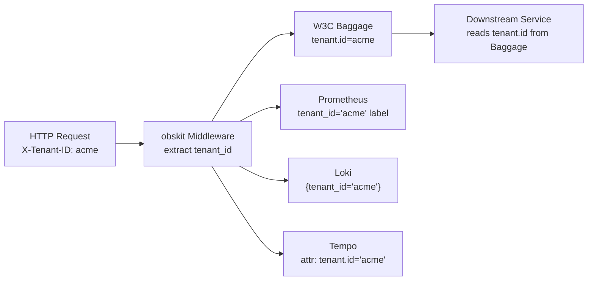

# Multi-Tenancy

In a SaaS system, a single obskit deployment serves multiple tenants. Observability must be tenant-aware: per-tenant metrics, logs filtered by tenant, traces tagged with tenant context, and health status scoped appropriately.

---

## Overview

obskit's multi-tenancy support is built on three primitives:

1. **W3C Baggage** — carries `tenant.id` through the entire request chain (HTTP headers → spans → downstream services)
2. **`TenantMetrics`** — records metrics with a `tenant_id` label, enforcing cardinality limits
3. **Context binding** — structlog context variables propagate `tenant_id` into every log line for the request



---

## Tenant ID Propagation via W3C Baggage

### Extracting tenant ID in middleware

=== "FastAPI"
    ```python
    from fastapi import FastAPI, Request
    from opentelemetry.baggage import set_baggage
    from opentelemetry import context
    import structlog

    app = FastAPI()

    @app.middleware("http")
    async def tenant_middleware(request: Request, call_next):
        tenant_id = (
            request.headers.get("X-Tenant-ID")
            or request.query_params.get("tenant_id")
            or "unknown"
        )

        # Set in W3C Baggage (propagates to downstream services via traceparent/baggage headers)
        ctx = set_baggage("tenant.id", tenant_id)

        # Set in structlog context (propagates to all log lines for this request)
        structlog.contextvars.bind_contextvars(tenant_id=tenant_id)

        response = await call_next(request)
        structlog.contextvars.clear_contextvars()
        return response
    ```

=== "Django"
    ```python
    from opentelemetry.baggage import set_baggage
    import structlog

    class TenantMiddleware:
        def __init__(self, get_response):
            self.get_response = get_response

        def __call__(self, request):
            tenant_id = (
                request.headers.get("X-Tenant-ID")
                or request.GET.get("tenant_id")
                or "unknown"
            )
            set_baggage("tenant.id", tenant_id)
            structlog.contextvars.bind_contextvars(tenant_id=tenant_id)
            response = self.get_response(request)
            structlog.contextvars.clear_contextvars()
            return response
    ```

=== "Flask"
    ```python
    from flask import Flask, g, request
    from opentelemetry.baggage import set_baggage
    import structlog

    app = Flask(__name__)

    @app.before_request
    def extract_tenant():
        g.tenant_id = request.headers.get("X-Tenant-ID", "unknown")
        set_baggage("tenant.id", g.tenant_id)
        structlog.contextvars.bind_contextvars(tenant_id=g.tenant_id)

    @app.teardown_request
    def clear_tenant(exc):
        structlog.contextvars.clear_contextvars()
    ```

### Reading tenant ID in downstream services

```python
from opentelemetry.baggage import get_baggage

def get_current_tenant() -> str:
    return get_baggage("tenant.id") or "unknown"

# Use in any handler:
tenant_id = get_current_tenant()
```

---

## Tenant-Aware Logging

With `structlog.contextvars.bind_contextvars(tenant_id=...)` set in middleware, every log line automatically includes the tenant:

```json
{"timestamp": "2026-02-28T14:32:07Z", "level": "info", "event": "report.generated",
 "tenant_id": "acme", "report_type": "usage", "rows": 48201, "duration_ms": 342}
```

### Loki queries for tenant-specific logs

```logql
# All logs for tenant "acme" in the last hour
{service="api"} | json | tenant_id="acme"

# Error logs for tenant "acme"
{service="api"} | json | tenant_id="acme" | level="error"

# Request rate per tenant
sum by (tenant_id) (rate({service="api"} | json [5m]))
```

---

## Per-Tenant Alerting

### Prometheus alert rules

```yaml
groups:
  - name: tenant-slo
    rules:
      # Alert when any tenant's error rate exceeds 5%
      - alert: TenantHighErrorRate
        expr: >
          (
            sum by (tenant_id) (rate(myapp_tenant_errors_total[5m]))
            /
            sum by (tenant_id) (rate(myapp_tenant_requests_total[5m]))
          ) > 0.05
        for: 5m
        labels:
          severity: warning
        annotations:
          summary: "Tenant {{ $labels.tenant_id }} error rate > 5%"
          description: "Error rate: {{ $value | humanizePercentage }}"

      # Alert when a specific high-value tenant has any degradation
      - alert: PremiumTenantDegraded
        expr: >
          (
            sum by (tenant_id) (rate(myapp_tenant_errors_total[5m]))
            /
            sum by (tenant_id) (rate(myapp_tenant_requests_total[5m]))
          ) > 0.01
          AND on (tenant_id) kube_configmap_info{configmap="premium-tenants"}
        for: 2m
        labels:
          severity: page
```

---

## Dashboard Filtering by Tenant

### Grafana variable for tenant filtering

Add a dashboard variable to filter all panels by tenant:

```json
{
  "name": "tenant_id",
  "type": "query",
  "datasource": "Prometheus",
  "query": "label_values(myapp_tenant_requests_total, tenant_id)",
  "includeAll": true,
  "multi": false,
  "current": {"text": "All", "value": "$__all"}
}
```

Use `$tenant_id` in all panel queries:

```promql
# Request rate for selected tenant
rate(myapp_tenant_requests_total{tenant_id="$tenant_id"}[5m])

# p99 latency for selected tenant
histogram_quantile(0.99,
  sum by (le) (rate(myapp_tenant_request_duration_seconds_bucket{tenant_id="$tenant_id"}[5m]))
)

# Error rate for selected tenant
sum(rate(myapp_tenant_errors_total{tenant_id="$tenant_id"}[5m]))
/ sum(rate(myapp_tenant_requests_total{tenant_id="$tenant_id"}[5m]))
```

---

## Multi-Tenant Health Checks

Check health per tenant by including tenant context in your health check results:

```python
from obskit.health import HealthChecker, HealthStatus
from obskit.health.checker import HealthResult
from obskit.slo import SLOTracker

# One SLO tracker per tenant (or use a shared tracker with per-tenant labels)
tenant_slos: dict[str, SLOTracker] = {}

def get_tenant_slo(tenant_id: str) -> SLOTracker:
    if tenant_id not in tenant_slos:
        tenant_slos[tenant_id] = SLOTracker(
            name=f"availability_{tenant_id}",
            objective=0.999,
            labels={"tenant_id": tenant_id},
        )
    return tenant_slos[tenant_id]

async def check_tenant_health(tenant_id: str) -> HealthResult:
    slo = get_tenant_slo(tenant_id)
    report = slo.get_report()
    if not report["is_within_slo"]:
        return HealthResult(
            status=HealthStatus.unhealthy,
            message=f"Tenant {tenant_id} SLO violated: SLI={report['sli']:.4%}",
        )
    return HealthResult(status=HealthStatus.healthy)
```

---

## Tenant Data Isolation

!!! warning "Metrics are not access control"
    Tenant metrics are a **visibility** tool, not a security boundary. A Prometheus query can still access any tenant's metrics. Restrict Grafana dashboard access using Grafana's RBAC and organisation features, or use Grafana's [multi-tenant data source proxies](https://grafana.com/docs/grafana/latest/administration/data-source-management/).

For Loki, use [Loki's multi-tenancy mode](https://grafana.com/docs/loki/latest/operations/multi-tenancy/) (`X-Scope-OrgID` header) to enforce hard isolation — tenants cannot query each other's logs.

```yaml
# loki-config.yml
auth_enabled: true   # Enables multi-tenant mode

# In your log shipper (Promtail / OTel Collector):
clients:
  - url: http://loki:3100/loki/api/v1/push
    tenant_id: acme    # Or dynamically set per request
```
