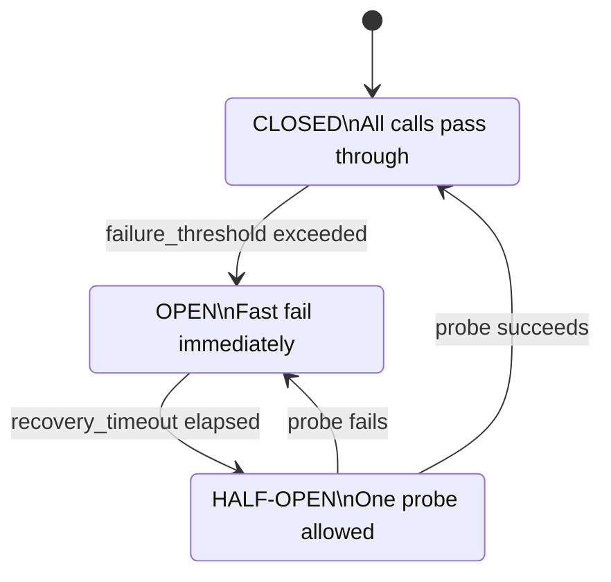

# Resilience

obskit provides circuit breakers, retry decorators, and rate limiters that integrate with your metrics and tracing pipelines. Every resilience event (circuit open, retry attempt, rate limit hit) is automatically recorded as a metric and a span attribute.

---

## Quick Start

```python
from obskit.resilience import CircuitBreaker, retry, RateLimiter

cb = CircuitBreaker(name="payment-gateway", failure_threshold=5, recovery_timeout=30)
limiter = RateLimiter(name="stripe-api", rate=100, per=1.0)   # 100 calls/second

@cb
@limiter
@retry(max_attempts=3, backoff=2.0)
async def call_payment_gateway(amount: int) -> dict:
    return await gateway.charge(amount)
```

---

## Circuit Breaker

### How it works

The circuit breaker monitors calls to an external dependency. When the failure rate exceeds a threshold, it **opens** the circuit: subsequent calls fail immediately (fast fail) without hitting the dependency. After a recovery timeout, it allows one **probe** request through. If the probe succeeds, the circuit **closes** again.



### CircuitBreaker API

```python
from obskit.resilience import CircuitBreaker
from obskit.resilience.circuit_breaker import CircuitState

cb = CircuitBreaker(
    name="payment-gateway",        # Used in metrics labels and logs
    failure_threshold=5,           # Open after 5 consecutive failures
    recovery_timeout=30.0,         # Seconds to wait in OPEN before probing
    success_threshold=2,           # Consecutive successes needed to re-close (HALF-OPEN)
    timeout=10.0,                  # Per-call timeout (seconds); None = no timeout
    excluded_exceptions=[ValueError],  # These exceptions do not count as failures
    fallback=None,                 # Optional async callable to invoke when OPEN
)
```

#### As a decorator

```python
@cb
async def fetch_user(user_id: str) -> dict:
    return await external_api.get_user(user_id)
```

When the circuit is OPEN, `fetch_user()` raises `CircuitBreakerOpenError` immediately without making a network call.

#### As a context manager

```python
async with cb:
    result = await external_api.get_user(user_id)
```

#### Inspecting state

```python
print(cb.state)           # CircuitState.closed | CircuitState.open | CircuitState.half_open
print(cb.failure_count)   # Current consecutive failure count
print(cb.success_count)   # Current consecutive success count (in HALF-OPEN)
print(cb.last_failure)    # Timestamp of most recent failure
```

#### Fallback

A fallback is called when the circuit is OPEN, allowing graceful degradation instead of an exception:

```python
async def recommend_defaults() -> list:
    return DEFAULT_RECOMMENDATIONS

cb = CircuitBreaker(
    name="recommendation-engine",
    failure_threshold=3,
    fallback=recommend_defaults,
)

@cb
async def get_recommendations(user_id: str) -> list:
    return await ml_service.recommend(user_id)

# When the circuit is open, get_recommendations() returns DEFAULT_RECOMMENDATIONS
# instead of raising CircuitBreakerOpenError
```

### Monitoring circuit state

obskit automatically records circuit state transitions as metrics:

```text
obskit_circuit_breaker_state{name="payment-gateway"} 0  # 0=closed, 1=open, 2=half_open
obskit_circuit_breaker_opens_total{name="payment-gateway"} 3
obskit_circuit_breaker_rejections_total{name="payment-gateway"} 142
```

Set up Prometheus alerts:

```yaml
# alerting-rules.yml
groups:
  - name: resilience
    rules:
      - alert: CircuitBreakerOpen
        expr: obskit_circuit_breaker_state > 0
        for: 1m
        labels:
          severity: warning
        annotations:
          summary: "Circuit breaker {{ $labels.name }} is OPEN"
```

---

## Retry

### `retry` decorator

```python
from obskit.resilience import retry

@retry(
    max_attempts=3,            # Total attempts (including first)
    backoff=2.0,               # Exponential backoff multiplier
    max_backoff=60.0,          # Maximum wait between retries (seconds)
    jitter=True,               # Add random ±20% jitter to backoff
    retry_on=(TimeoutError, ConnectionError),   # Only retry these exceptions
    stop_on=(ValueError, KeyError),             # Never retry these exceptions
)
async def call_external_api(payload: dict) -> dict:
    return await api_client.post("/data", json=payload)
```

#### Backoff progression

With `backoff=2.0`, `jitter=True`, and `max_backoff=60.0`:

| Attempt | Base wait | With jitter |
|---|---|---|
| 1st (initial) | 0s | 0s |
| 2nd retry | 1s | 0.8–1.2s |
| 3rd retry | 2s | 1.6–2.4s |
| 4th retry | 4s | 3.2–4.8s |
| 5th retry | 8s | 6.4–9.6s |

!!! tip "Always add jitter"
    Without jitter, all instances of your service retry at the same time after a dependency recovers — creating a "thundering herd" that overloads the recovering dependency. Jitter spreads retries across a time window.

#### Synchronous retry

```python
from obskit.resilience import retry

@retry(max_attempts=3, backoff=1.5)
def sync_operation():
    return db.execute("SELECT ...")
```

#### Retry with logging

obskit logs each retry attempt at `WARNING` level with the attempt number, exception, and wait duration:

```json
{"level": "warning", "event": "retry.attempt", "function": "call_external_api",
 "attempt": 2, "max_attempts": 3, "wait_seconds": 1.1, "error": "ConnectionError: ..."}
```

### `async_retry` decorator

```python
from obskit.resilience import async_retry

@async_retry(max_attempts=5, backoff=1.0, retry_on=(httpx.TimeoutException,))
async def fetch_data(url: str) -> bytes:
    async with httpx.AsyncClient() as client:
        resp = await client.get(url, timeout=10)
        resp.raise_for_status()
        return resp.content
```

---

## Rate Limiter

### RateLimiter API

obskit's `RateLimiter` uses a **token bucket** algorithm: tokens accumulate at the configured rate up to a maximum burst, and each call consumes one token.

```python
from obskit.resilience import RateLimiter

limiter = RateLimiter(
    name="stripe-api",
    rate=100,           # Replenishment rate: 100 tokens per `per` seconds
    per=1.0,            # Replenishment interval in seconds
    burst=150,          # Maximum token bucket size (allows short bursts above rate)
    blocking=True,      # True = wait for a token; False = raise RateLimitExceededError immediately
    timeout=5.0,        # Maximum time to wait for a token (blocking=True only)
)
```

#### As a decorator

```python
@limiter
async def send_notification(user_id: str, message: str):
    return await notification_service.send(user_id, message)
```

#### As a context manager

```python
async with limiter:
    response = await stripe_client.create_charge(amount=9900)
```

#### Non-blocking mode

```python
limiter = RateLimiter(name="api", rate=50, per=1.0, blocking=False)

try:
    async with limiter:
        result = await downstream.call()
except RateLimitExceededError:
    return {"error": "rate_limit_exceeded", "retry_after": 0.02}
```

### Rate limiter metrics

```text
obskit_rate_limiter_allowed_total{name="stripe-api"} 98234
obskit_rate_limiter_rejected_total{name="stripe-api"} 412
obskit_rate_limiter_wait_seconds_bucket{name="stripe-api", le="0.01"} 97891
```

---

## Combined Patterns

Layer resilience patterns using decorators. Order matters: the **outermost** decorator is invoked first.

```python
from obskit.resilience import CircuitBreaker, RateLimiter, retry

cb = CircuitBreaker(name="payment-gateway", failure_threshold=5)
limiter = RateLimiter(name="payment-gateway", rate=200, per=1.0)

# Execution order: rate limiter → retry → circuit breaker → actual call
@limiter    # 1. Check rate limit
@retry(max_attempts=3)   # 2. Retry on transient failures
@cb         # 3. Fast-fail if circuit is open
async def charge_card(amount: int) -> dict:
    return await gateway.charge(amount)
```

### Using the combined decorator

```python
from obskit.resilience.combined import with_resilience

@with_resilience(
    circuit_breaker={"name": "payment-gateway", "failure_threshold": 5},
    retry={"max_attempts": 3, "backoff": 2.0},
    rate_limiter={"name": "payment-gateway", "rate": 200, "per": 1.0},
)
async def charge_card(amount: int) -> dict:
    return await gateway.charge(amount)
```

---

## Distributed Circuit Breaker

For horizontally-scaled services, a per-instance circuit breaker may give a misleading picture: if one instance has 5 failures but others are healthy, the circuit does not open. A **distributed circuit breaker** uses Redis to share state across all instances.

```python
from obskit.resilience.distributed import DistributedCircuitBreaker

cb = DistributedCircuitBreaker(
    name="payment-gateway",
    failure_threshold=20,       # Across ALL instances in the cluster
    recovery_timeout=30.0,
    redis_url="redis://redis:6379",
    key_prefix="obskit:cb:",    # Redis key prefix
    ttl=300,                    # State TTL in seconds (auto-recovery if Redis goes away)
)

@cb
async def charge_card(amount: int):
    return await gateway.charge(amount)
```

!!! warning "Redis availability"
    If Redis becomes unavailable, the distributed circuit breaker falls back to **closed** state (permissive) by default. This is preferable to opening the circuit globally on Redis failure. Configure `fallback_state=CircuitState.closed` explicitly if you want to be certain of this behaviour.

---

## Adaptive Circuit Breaker

The adaptive circuit breaker adjusts thresholds based on observed error rate over a sliding time window, rather than a fixed consecutive-failures count:

```python
from obskit.resilience.adaptive import AdaptiveCircuitBreaker

cb = AdaptiveCircuitBreaker(
    name="ml-service",
    error_rate_threshold=0.5,    # Open when 50% of requests fail
    min_requests=10,             # Minimum requests before evaluating (avoid false opens on startup)
    window_seconds=60,           # Evaluate error rate over this sliding window
    recovery_timeout=30.0,
)
```

The sliding window approach is more robust than consecutive-failure counting for services with variable traffic — a burst of 5 errors in a high-traffic period may be irrelevant, while 5 errors during low traffic is significant.

---

## Factory Pattern

Use the factory to create resilience patterns from configuration:

```python
from obskit.resilience.factory import ResilienceFactory

factory = ResilienceFactory.from_config({
    "circuit_breaker": {
        "payment-gateway": {
            "failure_threshold": 5,
            "recovery_timeout": 30,
        },
        "recommendation-engine": {
            "failure_threshold": 10,
            "recovery_timeout": 15,
            "fallback": "recommend_defaults",
        },
    },
    "rate_limiter": {
        "stripe-api": {"rate": 100, "per": 1.0},
        "sendgrid-api": {"rate": 50, "per": 1.0},
    },
})

payment_cb = factory.get_circuit_breaker("payment-gateway")
stripe_limiter = factory.get_rate_limiter("stripe-api")
```

---

## Best Practices

### Timeouts are required

A circuit breaker without a timeout is incomplete. Without timeouts, slow requests hold threads/connections open until the circuit eventually opens — but by then, resource exhaustion may have already occurred.

```python
cb = CircuitBreaker(
    name="payment-gateway",
    failure_threshold=5,
    timeout=10.0,      # Every call has at most 10 seconds to succeed
)
```

### Set thresholds appropriate to traffic volume

A `failure_threshold=5` on a service handling 1000 RPS means the circuit opens within 5ms of a problem starting. On a service handling 1 RPM, it might take 5 minutes. Tune thresholds to your traffic pattern, or use the adaptive circuit breaker.

### Separate circuit breakers per dependency

Use one circuit breaker per external dependency, not one global breaker:

```python
# Good: independent circuit breakers
payment_cb = CircuitBreaker(name="payment-gateway")
inventory_cb = CircuitBreaker(name="inventory-service")
notification_cb = CircuitBreaker(name="notification-service")

# Bad: a global circuit breaker trips when any dependency fails
global_cb = CircuitBreaker(name="global")
```

### Log and alert on circuit state changes

```python
from obskit.resilience.circuit_breaker import CircuitStateChangeEvent

def on_state_change(event: CircuitStateChangeEvent):
    log.warning("circuit_breaker.state_change",
                name=event.name,
                from_state=event.from_state.value,
                to_state=event.to_state.value,
                failure_count=event.failure_count)

cb = CircuitBreaker(name="payment-gateway", on_state_change=on_state_change)
```

### Do not retry on non-transient errors

```python
# Good: only retry transient network errors
@retry(max_attempts=3, retry_on=(TimeoutError, ConnectionError, ServiceUnavailableError))
async def call_api(payload):
    ...

# Bad: retrying 400 Bad Request wastes time and may have side effects
@retry(max_attempts=3)  # retries ALL exceptions including 4xx
async def call_api(payload):
    ...
```

---

## Monitoring Resilience Patterns

obskit exposes metrics for all resilience components. Add these to your Grafana dashboards:

### Dashboard queries

```promql
# Circuit breaker open rate
sum by (name) (rate(obskit_circuit_breaker_opens_total[5m]))

# Retry rate (sign of instability)
sum by (function) (rate(obskit_retry_attempts_total{attempt!="1"}[5m]))

# Rate limiter rejection rate
sum by (name) (rate(obskit_rate_limiter_rejected_total[5m]))

# Current circuit breaker states
obskit_circuit_breaker_state
```

### Alerting rules

```yaml
groups:
  - name: resilience
    rules:
      - alert: CircuitBreakerOpen
        expr: obskit_circuit_breaker_state > 0
        for: 2m
        labels:
          severity: warning
        annotations:
          summary: "Circuit breaker {{ $labels.name }} has been open for 2+ minutes"

      - alert: HighRetryRate
        expr: >
          sum by (function) (rate(obskit_retry_attempts_total{attempt!="1"}[5m]))
          / sum by (function) (rate(obskit_retry_attempts_total{attempt="1"}[5m])) > 0.1
        for: 5m
        labels:
          severity: warning
        annotations:
          summary: "Retry rate for {{ $labels.function }} exceeds 10%"
```
