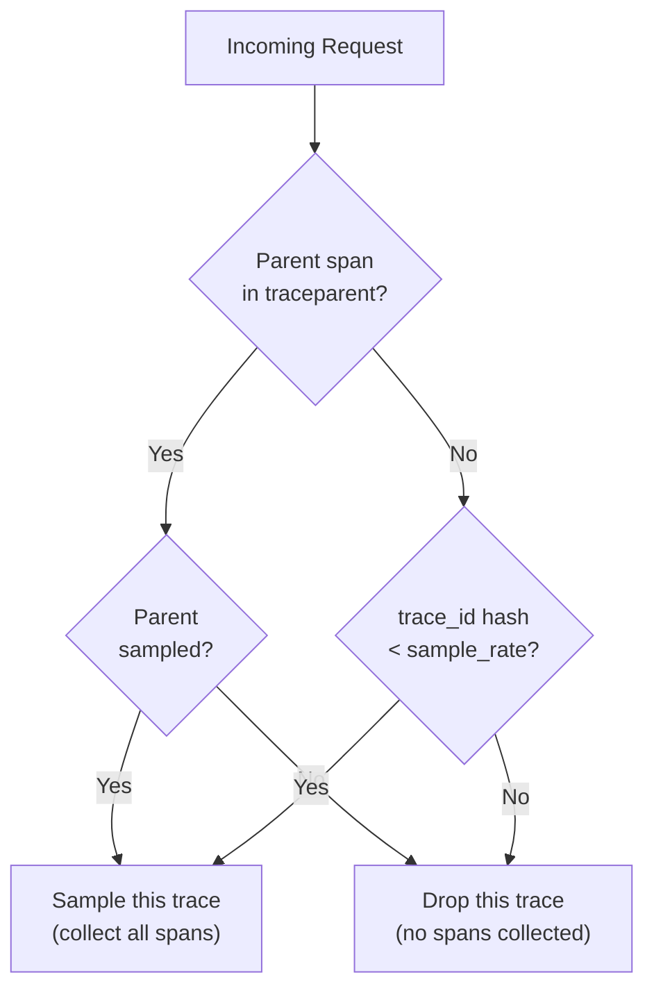

# Tracing

obskit wraps the OpenTelemetry Python SDK to give you a simple, opinionated tracing setup with minimal configuration. You get distributed tracing, auto-instrumentation for popular frameworks, and seamless correlation with logs and metrics.

---

## Quick Start

```python
from obskit.tracing import setup_tracing, trace_span

# Call once at application startup
setup_tracing(exporter_endpoint="http://tempo:4317")

# Wrap any operation in a span
with trace_span("process_order", attributes={"order_id": "ord_abc123"}) as span:
    result = process(order)
    span.set_attribute("items_count", len(result.items))
```

---

## `setup_tracing()` — Full Reference

```python
from obskit.tracing import setup_tracing

setup_tracing(
    exporter_endpoint="http://otel-collector:4317",  # OTLP gRPC endpoint
    sample_rate=1.0,          # 1.0 = trace everything, 0.1 = 10% sample rate
    debug=False,              # True → print spans to stdout (development only)
    service_name=None,        # Defaults to OTEL_SERVICE_NAME env var or "unknown"
    resource_attributes=None, # Extra resource attributes (dict)
    propagators=None,         # Defaults to W3C TraceContext + Baggage
)
```

### Parameters

| Parameter | Type | Default | Description |
|---|---|---|---|
| `exporter_endpoint` | `str` | required | OTLP gRPC endpoint for your tracing backend |
| `sample_rate` | `float` | `1.0` | Fraction of traces to sample (0.0–1.0) |
| `debug` | `bool` | `False` | Print spans to stdout; disables OTLP export |
| `service_name` | `str \| None` | env var | Overrides `OTEL_SERVICE_NAME` |
| `resource_attributes` | `dict \| None` | `{}` | Merged into the OTel Resource |
| `propagators` | `list \| None` | W3C TC + Baggage | Custom propagator list |

### Minimal production setup

```python
setup_tracing(
    exporter_endpoint="http://otel-collector:4317",
    sample_rate=0.1,     # 10% — tune based on request volume
)
```

### Development setup (debug mode)

```python
setup_tracing(
    exporter_endpoint="",   # Ignored in debug mode
    sample_rate=1.0,
    debug=True,
)
```

Debug output:
```
[obskit trace] span: process_order
  trace_id: 4bf92f3577b34da6a3ce929d0e0e4736
  span_id:  00f067aa0ba902b7
  duration: 142.3ms
  attrs:    order_id=ord_abc123 items_count=3
  status:   OK
```

### Environment variable configuration

All `setup_tracing()` parameters can be set via environment variables. Environment variables take precedence over code defaults.

| Environment Variable | Equivalent Parameter |
|---|---|
| `OTEL_SERVICE_NAME` | `service_name` |
| `OTEL_EXPORTER_OTLP_ENDPOINT` | `exporter_endpoint` |
| `OTEL_TRACES_SAMPLER_ARG` | `sample_rate` |
| `OTEL_RESOURCE_ATTRIBUTES` | `resource_attributes` (comma-separated `k=v`) |
| `OBSKIT_TRACE_DEBUG` | `debug` |

This lets you configure tracing per environment via Kubernetes ConfigMaps or `.env` files without changing code:

```yaml
# kubernetes deployment.yml
env:
  - name: OTEL_SERVICE_NAME
    value: "payment-service"
  - name: OTEL_EXPORTER_OTLP_ENDPOINT
    value: "http://otel-collector.monitoring:4317"
  - name: OTEL_TRACES_SAMPLER_ARG
    value: "0.1"
  - name: OTEL_RESOURCE_ATTRIBUTES
    value: "deployment.environment=production,service.version=2.0.0"
```

---

## Auto-Instrumentation

obskit uses OpenTelemetry's auto-instrumentation libraries to trace common frameworks without changing application code. Call `setup_tracing()` **before** importing the libraries you want to instrument.

### FastAPI

```python
from obskit.tracing import setup_tracing
setup_tracing(exporter_endpoint="http://tempo:4317")  # Must come first

from fastapi import FastAPI
app = FastAPI()

# Every request automatically gets a root span:
# span name: "GET /users/{user_id}"
# attributes: http.method, http.url, http.status_code, http.route, etc.
```

### SQLAlchemy

```python
from obskit.tracing import setup_tracing
setup_tracing(exporter_endpoint="http://tempo:4317")

from sqlalchemy import create_engine
engine = create_engine("postgresql://...")

# Every query is automatically traced:
# span name: "SELECT users"  
# attributes: db.system=postgresql, db.statement=SELECT ..., db.operation=SELECT
```

!!! warning "SQL statement in spans"
    By default SQLAlchemy auto-instrumentation includes the full SQL statement in the span. This can expose PII (e.g., `WHERE email = 'alice@example.com'`). Set `sanitize_query=True` in your OTel instrumentation config or use obskit's PII redaction pipeline.

### Redis

```python
from obskit.tracing import setup_tracing
setup_tracing(exporter_endpoint="http://tempo:4317")

import redis
client = redis.Redis(host="localhost")

# Every command is traced:
# span name: "GET"
# attributes: db.system=redis, db.operation=GET, net.peer.name=localhost
```

### httpx (outbound HTTP)

```python
from obskit.tracing import setup_tracing
setup_tracing(exporter_endpoint="http://tempo:4317")

import httpx
async with httpx.AsyncClient() as client:
    resp = await client.get("https://api.stripe.com/v1/charges")
# span: "GET" with http.method, http.url, http.status_code
# W3C traceparent header is automatically added to outbound requests
```

### Celery

```python
from obskit.tracing import setup_tracing
setup_tracing(exporter_endpoint="http://tempo:4317")

from celery import Celery
app = Celery("tasks", broker="redis://localhost")

@app.task
def send_email(to: str, subject: str):
    ...
# Task execution is traced with task.name, task.id attributes
```

### psycopg2 (direct Postgres)

```python
from obskit.tracing import setup_tracing
setup_tracing(exporter_endpoint="http://tempo:4317")

import psycopg2
conn = psycopg2.connect("postgresql://...")
# All queries traced with db.system=postgresql
```

### Full auto-instrumentation list

| Library | Instrumentation | Span attributes |
|---|---|---|
| FastAPI / Starlette | Routes, middleware | `http.method`, `http.route`, `http.status_code` |
| Flask | Request lifecycle | `http.method`, `http.route` |
| Django | Request/response | `http.method`, `http.route`, `http.status_code` |
| SQLAlchemy | ORM queries | `db.system`, `db.statement`, `db.operation` |
| psycopg2 | Raw Postgres | `db.system=postgresql`, `db.statement` |
| Redis | All commands | `db.system=redis`, `db.operation` |
| httpx | Outbound requests | `http.method`, `http.url`, `http.status_code` |
| requests | Outbound requests | `http.method`, `http.url`, `http.status_code` |
| aiohttp | Client + server | `http.method`, `http.url` |
| Celery | Task execution | `celery.task_name`, `celery.task_id` |
| grpc | gRPC calls | `rpc.system=grpc`, `rpc.method` |

---

## Manual Spans

### Synchronous spans

```python
from obskit.tracing import trace_span

with trace_span("compute.recommendations", attributes={"user_id": "u_abc"}) as span:
    recommendations = compute(user_id="u_abc")
    span.set_attribute("result_count", len(recommendations))
    span.add_event("cache_miss", attributes={"cache_key": "reco:u_abc"})
```

#### Span events

Events are timestamped annotations on a span — useful for marking key moments within a long operation:

```python
with trace_span("batch.process") as span:
    span.add_event("loading_started")
    records = load_records()
    span.add_event("loading_complete", attributes={"record_count": len(records)})

    span.add_event("processing_started")
    results = process_all(records)
    span.add_event("processing_complete", attributes={"success_count": results.ok})
```

#### Recording exceptions

```python
with trace_span("payment.charge") as span:
    try:
        charge_card(amount=9900)
    except PaymentError as exc:
        span.record_exception(exc)          # Captures exception type, message, stacktrace
        span.set_status(StatusCode.ERROR, str(exc))
        raise
```

### Asynchronous spans

```python
from obskit.tracing import async_trace_span

async def process_async():
    async with async_trace_span("async.fetch", attributes={"source": "s3"}) as span:
        data = await fetch_from_s3(bucket="my-bucket", key="data.json")
        span.set_attribute("bytes_fetched", len(data))
        return data
```

### Nested spans

Spans automatically form a tree based on Python's context variable (`contextvars`):

```python
with trace_span("order.fulfil") as parent:
    with trace_span("inventory.reserve") as child1:
        reserve_stock(items)
        # child1 is a child of parent in the trace tree

    with trace_span("payment.charge") as child2:
        charge_card(amount)
        # child2 is also a child of parent
```

```
order.fulfil (142ms)
├── inventory.reserve (23ms)
└── payment.charge (118ms)
    └── db.INSERT payments (95ms)  ← auto-instrumented
```

---

## W3C Trace Context Propagation

obskit uses **W3C TraceContext** (`traceparent` / `tracestate`) and **W3C Baggage** by default. These are the IETF-standardised propagation formats.

### Propagating context in HTTP services

When using auto-instrumented HTTP clients (httpx, requests), the `traceparent` header is added automatically.

For manual propagation with a custom HTTP client:

```python
from opentelemetry import propagate

headers = {}
propagate.inject(headers)   # Adds traceparent (and tracestate/baggage if present)

response = my_custom_client.get("https://downstream-service/api", headers=headers)
```

### Extracting context from incoming requests

```python
from opentelemetry import propagate
from opentelemetry.context import attach

def handle_request(incoming_headers: dict):
    # Extract upstream trace context
    ctx = propagate.extract(incoming_headers)
    token = attach(ctx)
    try:
        # Any spans created here will be children of the upstream span
        with trace_span("handle_request"):
            return do_work()
    finally:
        from opentelemetry.context import detach
        detach(token)
```

### Baggage

W3C Baggage carries key-value context alongside trace context. obskit uses it to propagate tenant IDs, feature flags, and other cross-cutting context:

```python
from opentelemetry.baggage import set_baggage, get_baggage
from opentelemetry import context

# In middleware — set baggage on incoming request
ctx = context.get_current()
ctx = set_baggage("tenant.id", "tenant_abc", context=ctx)
# Subsequent spans and downstream services receive tenant.id in Baggage header

# In a downstream service handler:
tenant_id = get_baggage("tenant.id")
```

---

## Adaptive Sampling

### Why sampling?

At 10,000 requests per second, collecting every trace generates ~1 TB of data per day. Sampling reduces this to a manageable volume while preserving statistical accuracy for latency percentiles.

### Configuration

```python
setup_tracing(
    exporter_endpoint="http://tempo:4317",
    sample_rate=0.01,   # 1% of traces
)
```

obskit uses OpenTelemetry's `ParentBased(TraceIdRatioBased(sample_rate))` sampler:

- **`TraceIdRatioBased`**: Deterministically samples based on the trace ID, ensuring the same trace is sampled consistently across services.
- **`ParentBased`**: Honours the upstream service's sampling decision. If the upstream sampled this trace, this service samples it too (and vice versa). This prevents broken traces where some spans are sampled and others are not.



### Always-on sampling for errors

obskit's middleware automatically sets the `RECORD` flag on error spans regardless of sampling rate, ensuring error traces are never dropped:

```python
# Internal middleware behaviour — no configuration needed
if response.status_code >= 500:
    span.set_status(StatusCode.ERROR)
    span.set_attribute("sampling.priority", 1)  # Force-sample this trace
```

---

## OTLP Export Configuration

### Grafana Tempo (recommended)

```python
setup_tracing(
    exporter_endpoint="http://tempo:4317",   # Tempo's OTLP gRPC port
    sample_rate=0.1,
    resource_attributes={
        "service.name": "payment-service",
        "service.version": "2.0.0",
        "deployment.environment": "production",
    },
)
```

### via OpenTelemetry Collector (recommended for production)

Route through an OTel Collector for batching, retry, and multi-backend export:

```yaml
# otel-collector-config.yml
receivers:
  otlp:
    protocols:
      grpc:
        endpoint: 0.0.0.0:4317

processors:
  batch:
    timeout: 5s
    send_batch_size: 512

exporters:
  otlp/tempo:
    endpoint: tempo:4317
    tls:
      insecure: true
  logging:
    verbosity: detailed    # For debugging

service:
  pipelines:
    traces:
      receivers: [otlp]
      processors: [batch]
      exporters: [otlp/tempo]
```

```python
# Point your services at the collector, not Tempo directly
setup_tracing(exporter_endpoint="http://otel-collector:4317")
```

### Jaeger

```python
setup_tracing(
    exporter_endpoint="http://jaeger:4317",   # Jaeger supports OTLP natively since v1.35
)
```

### Zipkin

Zipkin uses a different protocol. Configure through the OTel Collector:

```yaml
exporters:
  zipkin:
    endpoint: "http://zipkin:9411/api/v2/spans"
```

---

## Connecting to Grafana

### Tempo + Loki + Prometheus correlation

Grafana's correlation feature lets you jump between traces, logs, and metrics using a shared `trace_id`.

#### Grafana data source configuration

```yaml
# grafana/provisioning/datasources/datasources.yml
apiVersion: 1
datasources:
  - name: Prometheus
    type: prometheus
    url: http://prometheus:9090

  - name: Loki
    type: loki
    url: http://loki:3100
    jsonData:
      derivedFields:
        - datasourceUid: tempo_uid
          matcherRegex: '"trace_id":"(\w+)"'
          name: TraceID
          url: "$${__value.raw}"           # Links log line to Tempo trace

  - name: Tempo
    type: tempo
    uid: tempo_uid
    url: http://tempo:3200
    jsonData:
      tracesToLogs:
        datasourceUid: loki_uid
        filterByTraceID: true
        filterBySpanID: false
      tracesToMetrics:
        datasourceUid: prometheus_uid
        queries:
          - name: "Request rate"
            query: "rate(myapp_requests_total{service='$${__span.tags.service.name}'}[1m])"
```

With this configuration:
1. Metric alert → click exemplar → Tempo trace
2. Tempo trace → "Logs for this trace" → Loki logs filtered by `trace_id`
3. Tempo trace → "Metrics" panel → Prometheus query scoped to that service

---

## Trace Sampling Strategies by Environment

=== "Development"
    ```python
    setup_tracing(
        exporter_endpoint="",   # Ignored in debug mode
        sample_rate=1.0,        # Trace everything
        debug=True,             # Print to stdout
    )
    ```

=== "Staging"
    ```python
    setup_tracing(
        exporter_endpoint="http://otel-collector.staging:4317",
        sample_rate=1.0,        # Trace everything — traffic is low
    )
    ```

=== "Production (low traffic)"
    ```python
    setup_tracing(
        exporter_endpoint="http://otel-collector:4317",
        sample_rate=1.0,        # < 100 RPS — can afford full sampling
    )
    ```

=== "Production (high traffic)"
    ```python
    setup_tracing(
        exporter_endpoint="http://otel-collector:4317",
        sample_rate=0.01,       # 1% — adjust based on storage budget
    )
    ```

---

## Best Practices

| Practice | Why |
|---|---|
| Call `setup_tracing()` before importing instrumented libraries | Auto-instrumentation patches at import time |
| Use route patterns in span names, not raw URLs | Avoids cardinality explosion in Tempo |
| Set `service.name` consistently across all services | Essential for cross-service trace stitching |
| Record exceptions with `span.record_exception()` | Preserves stacktrace in the trace UI |
| Keep span attribute values small | Large string values increase storage cost |
| Use baggage for cross-cutting context (tenant ID, user ID) | Propagates to all downstream services automatically |
| Route through OTel Collector in production | Decouples your app from backend changes; adds retry/batching |
| Use `sample_rate < 1.0` above 500 RPS | Full sampling at scale is expensive |
